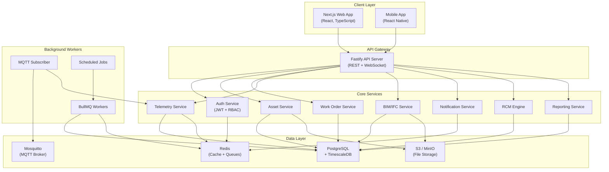

<p align="center">
  <h1 align="center">🏗️ EAM / AIM / RCM Platform</h1>
  <p align="center">
    <strong>Enterprise Asset Management · Asset Information Management · Reliability-Centered Maintenance</strong>
  </p>
</p>

<p align="center">
  
  
  
  
  
</p>

---

## 📋 Overview

A **full-stack, standards-compliant** platform for managing physical assets across their entire lifecycle — from BIM design through commissioning, operation, maintenance, and decommissioning.

The platform unifies **Enterprise Asset Management (EAM)**, **Asset Information Management (AIM)** with BIM/IFC integration, and **Reliability-Centered Maintenance (RCM)** into a single, real-time system powered by IoT telemetry and advanced analytics.

### Key Capabilities

- 🏢 **Asset Hierarchy & Registry** — Multi-level asset taxonomy with full lifecycle tracking
- 📐 **BIM/IFC Integration** — Native IFC 4.3 parsing, 3D viewer, and asset-to-element linking
- 📡 **IoT Telemetry Ingestion** — Real-time MQTT sensor data with TimescaleDB time-series storage
- 🔧 **Work Order Management** — Preventive, predictive, corrective, and condition-based maintenance
- 📊 **RCM Analysis** — FMEA, failure mode tracking, criticality assessment, and reliability analytics
- 📋 **Inspection & Condition Monitoring** — Configurable inspection templates with photo evidence
- 💰 **Financial Tracking** — CAPEX/OPEX, depreciation, LCC analysis, and budget management
- 🔔 **Real-time Alerts** — Threshold-based alarms, anomaly detection, and notification routing
- 📈 **Dashboards & Reporting** — KPI dashboards, OEE, MTBF/MTTR, and compliance reports

---

## 🏛️ Architecture



---

## 🛠️ Tech Stack

| Layer | Technology | Purpose |
|-------|------------|---------|
| **Runtime** | Node.js ≥ 20 | Server-side JavaScript runtime |
| **Language** | TypeScript 5.7 | Type-safe development |
| **API Framework** | Fastify | High-performance REST API |
| **Web Frontend** | Next.js 15 (App Router) | React-based web application |
| **Database** | PostgreSQL 16 + TimescaleDB | Relational + time-series data |
| **ORM** | Drizzle ORM | Type-safe database queries |
| **Cache / Queues** | Redis + BullMQ | Caching, job queues, pub/sub |
| **IoT Protocol** | MQTT (Mosquitto) | Sensor telemetry ingestion |
| **Object Storage** | S3 / MinIO | File & document storage |
| **Monorepo** | pnpm + Turborepo | Workspace & build orchestration |
| **Testing** | Vitest | Unit & integration testing |
| **Linting** | ESLint + Prettier | Code quality & formatting |
| **Containerization** | Docker Compose | Local development environment |

---

## 📏 Standards Compliance

| Standard | Scope | Description |
|----------|-------|-------------|
| **ISO 55000** | Asset Management | Asset management system framework |
| **ISO 55001/55002** | Asset Management | Requirements and implementation guidance |
| **ISO 19650** | BIM | Information management using BIM |
| **ISO 14224** | Reliability | Equipment reliability and maintenance data |
| **SAE JA1011** | RCM | Reliability-Centered Maintenance criteria |
| **SAE JA1012** | RCM | RCM evaluation guide |
| **EN 17412** | BIM | Level of Information Need |
| **IFC 4.3** | BIM | Industry Foundation Classes data schema |
| **ISO 15926** | Data Integration | Industrial data lifecycle integration |

---

## 🚀 Quick Start

### Prerequisites

- **Node.js** ≥ 20.0.0
- **pnpm** ≥ 9.0.0
- **Docker** & **Docker Compose** (for local services)
- **Git**

### 1. Clone & Install

```bash
git clone https://github.com/anigravity/eamaim-platform.git
cd eamaim-platform

# Install dependencies
pnpm install
```

### 2. Configure Environment

```bash
# Copy the example env file
cp .env.example .env

# Edit .env with your local settings (the defaults work with Docker Compose)
```

### 3. Start Infrastructure

```bash
# Start PostgreSQL + TimescaleDB, Redis, Mosquitto, MinIO, PgAdmin
pnpm docker:up
```

### 4. Set Up Database

```bash
# Generate Drizzle ORM types
pnpm db:generate

# Run migrations
pnpm db:migrate

# Seed with sample data (optional)
pnpm db:seed
```

### 5. Start Development

```bash
# Start all apps & services in dev mode
pnpm dev
```

The following services will be available:

| Service | URL |
|---------|-----|
| Web App | [http://localhost:3000](http://localhost:3000) |
| API Server | [http://localhost:4000](http://localhost:4000) |
| API Docs (Swagger) | [http://localhost:4000/docs](http://localhost:4000/docs) |
| PgAdmin | [http://localhost:5050](http://localhost:5050) |
| MinIO Console | [http://localhost:9001](http://localhost:9001) |
| Drizzle Studio | [https://local.drizzle.studio](https://local.drizzle.studio) |

---

## 📁 Project Structure

```
eamaim-platform/
├── apps/
│   ├── api/                  # Fastify REST API server
│   │   ├── src/
│   │   │   ├── modules/      # Feature modules (assets, work-orders, telemetry, etc.)
│   │   │   ├── middleware/    # Auth, validation, rate-limiting
│   │   │   ├── plugins/      # Fastify plugins
│   │   │   └── server.ts     # Server entry point
│   │   └── package.json
│   │
│   ├── web/                  # Next.js web application
│   │   ├── src/
│   │   │   ├── app/          # App Router pages & layouts
│   │   │   ├── components/   # React components
│   │   │   ├── hooks/        # Custom React hooks
│   │   │   ├── lib/          # Client utilities
│   │   │   └── stores/       # State management
│   │   └── package.json
│   │
│   └── workers/              # Background job processors
│       ├── src/
│       │   ├── jobs/         # BullMQ job handlers
│       │   ├── mqtt/         # MQTT subscriber & handlers
│       │   └── cron/         # Scheduled tasks
│       └── package.json
│
├── packages/
│   ├── db/                   # Drizzle ORM schema & migrations
│   │   ├── src/
│   │   │   ├── schema/       # Table definitions
│   │   │   ├── migrations/   # SQL migration files
│   │   │   └── seed/         # Seed data
│   │   └── package.json
│   │
│   ├── shared/               # Shared utilities & helpers
│   ├── types/                # Shared TypeScript types & interfaces
│   ├── validators/           # Zod schemas & validation
│   ├── config/               # Configuration management
│   ├── logger/               # Structured logging (Pino)
│   ├── auth/                 # Authentication & authorization
│   ├── queue/                # BullMQ queue definitions
│   ├── telemetry/            # Telemetry processing utilities
│   └── ifc-parser/           # IFC file parsing & transformation
│
├── docker/                   # Docker configurations
│   ├── docker-compose.yml
│   └── services/             # Per-service Dockerfiles
│
├── docs/                     # Documentation
│   ├── architecture/
│   ├── api/
│   └── standards/
│
├── turbo.json                # Turborepo pipeline configuration
├── tsconfig.base.json        # Shared TypeScript configuration
├── package.json              # Root workspace package.json
├── pnpm-workspace.yaml       # pnpm workspace definition
├── .eslintrc.js              # Shared ESLint configuration
├── .prettierrc               # Prettier formatting rules
├── .env.example              # Environment variable template
└── .gitignore                # Git ignore rules
```

---

## 🔄 Development Workflow

### Common Commands

```bash
# Development
pnpm dev                      # Start all apps in dev mode
pnpm dev --filter=@eamaim/api # Start only the API

# Building
pnpm build                    # Build all packages & apps
pnpm build --filter=@eamaim/web # Build only the web app

# Testing
pnpm test                     # Run all tests
pnpm test:coverage            # Run tests with coverage

# Code Quality
pnpm lint                     # Lint all packages
pnpm lint:fix                 # Auto-fix lint issues
pnpm format:write             # Format all files
pnpm typecheck                # Run TypeScript type checking

# Database
pnpm db:generate              # Generate Drizzle types from schema
pnpm db:migrate               # Apply pending migrations
pnpm db:studio                # Open Drizzle Studio GUI
pnpm db:seed                  # Seed database with sample data

# Docker
pnpm docker:up                # Start all infrastructure services
pnpm docker:down              # Stop all infrastructure services
pnpm docker:logs              # Tail service logs
pnpm docker:clean             # Remove containers, volumes, and networks

# Maintenance
pnpm clean                    # Remove all build artifacts & node_modules
```

### Adding a New Package

```bash
# Create a new shared package
mkdir -p packages/my-package/src
cd packages/my-package

# Initialize with package.json
pnpm init

# Add it as a dependency to another package
pnpm add @eamaim/my-package --filter=@eamaim/api --workspace
```

---

## 🐳 Docker Setup

The project includes a Docker Compose configuration for local development infrastructure:

```bash
# Start all services
pnpm docker:up

# Services included:
# - PostgreSQL 16 + TimescaleDB    (port 5432)
# - Redis 7                         (port 6379)
# - Mosquitto MQTT Broker           (port 1883, ws: 9883)
# - MinIO (S3-compatible storage)   (port 9000, console: 9001)
# - PgAdmin 4                       (port 5050)
```

### Docker Compose Services

| Service | Image | Ports |
|---------|-------|-------|
| PostgreSQL + TimescaleDB | `timescale/timescaledb:latest-pg16` | `5432` |
| Redis | `redis:7-alpine` | `6379` |
| Mosquitto | `eclipse-mosquitto:2` | `1883`, `9883` |
| MinIO | `minio/minio:latest` | `9000`, `9001` |
| PgAdmin | `dpage/pgadmin4:latest` | `5050` |

---

## 🤝 Contributing

We welcome contributions! Please see our [Contributing Guide](./CONTRIBUTING.md) for details on:

- Code of Conduct
- Development setup
- Pull request process
- Coding standards
- Commit message conventions

### Commit Convention

We follow [Conventional Commits](https://www.conventionalcommits.org/):

```
feat(assets): add criticality assessment scoring
fix(telemetry): handle null sensor readings gracefully
docs(api): update work order endpoint documentation
chore(deps): bump drizzle-orm to v0.38.0
```

---

## 📄 License

**PROPRIETARY** — All rights reserved.

This software is proprietary and confidential. Unauthorized copying, distribution, or modification is strictly prohibited. See the [LICENSE](./LICENSE) file for details.

---

<p align="center">
  Built with ❤️ by <strong>Anigravity</strong>
</p>
