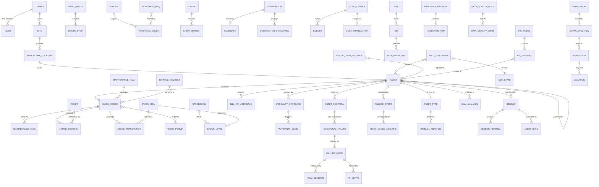

# EAM / AIM / RCM Platform — Implementation Plan (v3)

## Overview

Build an enterprise-grade, **multi-tenant** Asset Management Platform that unifies **Enterprise Asset Management (EAM)**, **Asset Information Management (AIM)**, and **Reliability Centered Maintenance (RCM)** under a single **Common Data Environment (CDE)** compliant with ISO 19650. The platform enforces **OIR** and **AIR** requirements, ingests **IoT/SCADA telemetry**, supports **BIM/IFC integration**, tracks **regulatory compliance** (OSHA, EPA, NRC), and provides **dual authentication** (standalone + SSO).

### Standards Compliance Matrix

| Standard | Domain | Coverage |
|:---------|:-------|:---------|
| **ISO 55000/55001/55002** | Asset Management System | Lifecycle management, value realization, risk-based decisions |
| **ISO 19650-1/2/3** | Information Management (BIM) | CDE workflow, OIR → AIR → EIR cascade, information states |
| **ISO 14224** | Reliability & Maintenance Data | Equipment taxonomy, failure classification, maintenance coding |
| **Uniclass 2015** | Asset Classification | Standardized classification tables (Entities, Systems, Products) |
| **IEC 60812** | FMEA/FMECA | Failure mode analysis methodology |
| **SAE JA1011/JA1012** | RCM Standard | Seven-question RCM methodology, decision logic |
| **IFC 4.3 (ISO 16739)** | BIM Data Exchange | Building Information Model import/linking |
| **OSHA / EPA / NRC** | Regulatory | Safety, environmental, nuclear compliance tracking |
| **EN 17412-1** | Level of Information Need | LOIN framework for geometry, alphanumeric, documentation |

---

## Gap Analysis — Validation Results

> [!CAUTION]
> The v2 plan had **23 missing schema modules** across EAM, RCM, and AIM. All gaps are identified below and resolved in this v3 update.

### EAM Module — Gap Analysis

| # | Functionality | v2 Status | Gap Description | v3 Resolution |
|:-:|:-------------|:---------:|:----------------|:-------------|
| 1 | Asset Register | ✅ Complete | — | No change needed |
| 2 | Asset Hierarchy (Physical + Functional) | ✅ Complete | — | No change needed |
| 3 | Asset Types & Dynamic Attributes | ✅ Complete | — | No change needed |
| 4 | Asset Lifecycle & Financials | ✅ Complete | — | No change needed |
| 5 | Asset Classification (Uniclass/ISO 14224) | ✅ Complete | — | No change needed |
| 6 | Work Order Management | ⚠️ Partial | Missing: work order types, priority SLA, approval workflow, safety requirements, service request linkage | Enhanced with `work_order_types`, `approval_steps`, `safety_requirements`, `service_request_id` FK |
| 7 | Maintenance Plans (PM Schedules) | ⚠️ Partial | Missing: meter-based and condition-based triggers, route-based PM, shutdown planning | Enhanced with `trigger_type` enum, route-based tables, shutdown planning module |
| 8 | Maintenance Tasks | ✅ Complete | — | No change needed |
| 9 | Spare Parts | ⚠️ Partial | Missing: warehouse/storeroom, stock transactions, BOM structure, reorder automation | Enhanced → full inventory module |
| 10 | **Labor & Workforce Management** | ❌ Missing | No tables for crafts, crews, shifts, labor rates, labor booking to work orders, certifications | **NEW: `labor/` schema module** |
| 11 | **Inventory & Warehouse Management** | ❌ Missing | No storeroom model, stock transactions (issue/receive/return/transfer), cycle counts | **NEW: `inventory/` schema module** |
| 12 | **Procurement Management** | ❌ Missing | No purchase requisitions, POs, vendor registry, receiving, invoice matching | **NEW: `procurement/` schema module** |
| 13 | **Warranty Management** | ❌ Missing | Only warranty fields on asset — no warranty terms, claims, claim tracking | **NEW: `warranty/` schema module** |
| 14 | **SLA Management** | ❌ Missing | No service level definitions, response/resolution time tracking, breach alerts | **NEW: `sla/` schema module** |
| 15 | **Contractor Management** | ❌ Missing | No contractor registry, contract tracking, contractor safety/compliance | **NEW: `contractors/` schema module** |
| 16 | **Work Permits & Safety Isolation** | ❌ Missing | No LOTO, hot work permits, confined space, isolation points | **NEW: `safety/` schema module** |
| 17 | **Budget & Cost Management** | ❌ Missing | No budget tables, cost centers, cost allocation, TCO tracking | **NEW: `financials/` schema module** |
| 18 | **Capital Projects & MOC** | ❌ Missing | No project tracking, Management of Change | **NEW: `projects/` schema module** |
| 19 | **Service Requests** | ❌ Missing | No service request portal, request-to-WO conversion | **NEW: `service-requests/` schema module** |
| 20 | **Route-Based Maintenance** | ❌ Missing | No maintenance routes, route stops, route execution | **NEW: Added to `maintenance/` module** |
| 21 | **Shutdown/Turnaround Planning** | ❌ Missing | No shutdown events, scope, scheduling | **NEW: Added to `maintenance/` module** |
| 22 | Telemetry/IoT | ✅ Complete | — | No change needed |
| 23 | Regulatory Compliance | ✅ Complete | — | No change needed |

---

### RCM Module — Gap Analysis

| # | Functionality | v2 Status | Gap Description | v3 Resolution |
|:-:|:-------------|:---------:|:----------------|:-------------|
| 1 | Failure Modes Library | ✅ Complete | — | No change needed |
| 2 | FMEA Analysis | ⚠️ Partial | Missing: explicit function definitions and functional failures (SAE JA1011 seven questions) | Enhanced with `functions` and `functional_failures` tables |
| 3 | Failure Events | ✅ Complete | — | No change needed |
| 4 | RCM Decision Logic | ✅ Complete | — | No change needed |
| 5 | Criticality Analysis | ✅ Complete | — | No change needed |
| 6 | Reliability Metrics (MTBF/MTTR) | ✅ Complete | — | No change needed |
| 7 | **Functions & Functional Failures** | ❌ Missing | RCM starts with defining functions — no tables for asset functions, performance standards, or functional failure modes | **NEW: `rcm/functions.ts`, `rcm/functional-failures.ts`** |
| 8 | **Root Cause Analysis (RCA)** | ❌ Missing | No 5-Why, Fishbone/Ishikawa, or Fault Tree Analysis data structures | **NEW: `rcm/root-cause-analysis.ts`** |
| 9 | **P-F Curve Modeling** | ❌ Missing | No P-F interval tracking, condition-to-failure progression modeling | **NEW: `rcm/pf-curves.ts`** |
| 10 | **Weibull Analysis** | ❌ Missing | Mentioned but no schema — needs beta, eta, gamma parameters, goodness-of-fit | **NEW: `rcm/weibull-analysis.ts`** |
| 11 | **RAM Analysis** | ❌ Missing | No system-level Reliability/Availability/Maintainability modeling | **NEW: `rcm/ram-analysis.ts`** |
| 12 | **Maintenance Task Packaging** | ❌ Missing | No grouping of tasks by interval/trade/route for execution optimization | **NEW: `rcm/task-packages.ts`** |

---

### AIM Module — Gap Analysis

| # | Functionality | v2 Status | Gap Description | v3 Resolution |
|:-:|:-------------|:---------:|:----------------|:-------------|
| 1 | CDE Information Containers | ✅ Complete | — | No change needed |
| 2 | CDE Four-State Workflow | ✅ Complete | — | No change needed |
| 3 | CDE Revision History | ✅ Complete | — | No change needed |
| 4 | OIR (Organizational Info Requirements) | ✅ Complete | — | No change needed |
| 5 | AIR (Asset Info Requirements) | ✅ Complete | — | No change needed |
| 6 | EIR (Exchange Info Requirements) | ✅ Complete | — | No change needed |
| 7 | AIR Compliance Checks | ✅ Complete | — | No change needed |
| 8 | Information Delivery Plans (MIDP/TIDP) | ✅ Complete | — | No change needed |
| 9 | BIM/IFC Integration | ✅ Complete | — | No change needed |
| 10 | **Level of Information Need (LOIN)** | ❌ Missing | No tables for geometry requirements, alphanumeric requirements, documentation requirements per EN 17412-1 | **NEW: `oir-air/loin-definitions.ts`** |
| 11 | **PIM-to-AIM Handover Management** | ❌ Missing | No handover checklists, validation workflows, Soft Landings framework | **NEW: `cde/handover-management.ts`** |
| 12 | **Data Quality Management** | ❌ Missing | No data quality rules, quality scoring, cleansing workflows, completeness tracking | **NEW: `cde/data-quality.ts`** |
| 13 | **Data Dictionary Management** | ❌ Missing | No attribute dictionary, standard property sets, mapping templates | **NEW: `cde/data-dictionary.ts`** |
| 14 | **Digital Twin Foundation** | ❌ Missing | No asset-model synchronization, spatial data management, live state tracking | **NEW: `cde/digital-twin.ts`** |

---

## Technology Stack

*(Unchanged from v2 — PostgreSQL + TimescaleDB + Node.js/TypeScript + Fastify + Drizzle ORM + Next.js + Redis)*

---

## Updated GitHub Repository Structure (v3)

> [!NOTE]
> New modules added in v3 are marked with `# [v3 NEW]`

```
eam-aim-rcm-platform/
│
├── .github/                                    # GitHub configuration
│   ├── workflows/
│   │   ├── ci.yml
│   │   ├── cd-staging.yml
│   │   └── cd-production.yml
│   ├── ISSUE_TEMPLATE/
│   │   ├── bug_report.md
│   │   ├── feature_request.md
│   │   └── schema_change.md
│   ├── PULL_REQUEST_TEMPLATE.md
│   └── CODEOWNERS
│
├── docs/                                       # 📚 Documentation hub
│   ├── architecture/
│   │   ├── system-overview.md
│   │   ├── data-flow.md
│   │   ├── cde-workflow.md
│   │   ├── telemetry-pipeline.md
│   │   ├── multi-tenancy.md
│   │   └── diagrams/
│   ├── standards/
│   │   ├── iso-55000-mapping.md
│   │   ├── iso-19650-mapping.md
│   │   ├── iso-14224-taxonomy.md
│   │   ├── sae-ja1011-rcm-mapping.md            # [v3 NEW]
│   │   ├── en-17412-loin-mapping.md              # [v3 NEW]
│   │   ├── ifc-integration.md
│   │   ├── regulatory-framework.md
│   │   └── oir-air-framework.md
│   ├── database/
│   │   ├── erd-overview.md
│   │   ├── data-dictionary.md
│   │   ├── timescaledb-guide.md
│   │   └── schema-conventions.md
│   ├── api/
│   │   ├── openapi.yaml
│   │   ├── authentication.md
│   │   └── mqtt-telemetry-api.md
│   └── guides/
│       ├── getting-started.md
│       ├── contributing.md
│       ├── tenant-onboarding.md
│       └── deployment.md
│
├── packages/
│   │
│   ├── database/                               # 🔑 CORE: Database schema & ORM
│   │   ├── src/
│   │   │   ├── schema/
│   │   │   │   ├── index.ts
│   │   │   │   │
│   │   │   │   ├── core/                       # ── Multi-tenant foundation ──
│   │   │   │   │   ├── tenants.ts
│   │   │   │   │   ├── users.ts
│   │   │   │   │   ├── roles-permissions.ts
│   │   │   │   │   ├── audit-log.ts
│   │   │   │   │   └── rls-policies.ts
│   │   │   │   │
│   │   │   │   ├── auth/                       # ── Authentication ──
│   │   │   │   │   ├── sessions.ts
│   │   │   │   │   ├── sso-providers.ts
│   │   │   │   │   ├── api-keys.ts
│   │   │   │   │   └── mfa-tokens.ts
│   │   │   │   │
│   │   │   │   ├── asset-register/             # ── Asset Register ──
│   │   │   │   │   ├── assets.ts
│   │   │   │   │   ├── asset-types.ts
│   │   │   │   │   ├── asset-hierarchy.ts
│   │   │   │   │   ├── functional-locations.ts
│   │   │   │   │   ├── asset-attributes.ts
│   │   │   │   │   ├── asset-lifecycle.ts
│   │   │   │   │   └── asset-classification.ts
│   │   │   │   │
│   │   │   │   ├── cde/                        # ── Common Data Environment ──
│   │   │   │   │   ├── information-containers.ts
│   │   │   │   │   ├── cde-states.ts
│   │   │   │   │   ├── cde-workflows.ts
│   │   │   │   │   ├── document-registry.ts
│   │   │   │   │   ├── revision-history.ts
│   │   │   │   │   ├── handover-management.ts    # [v3 NEW]
│   │   │   │   │   ├── data-quality.ts           # [v3 NEW]
│   │   │   │   │   ├── data-dictionary.ts        # [v3 NEW]
│   │   │   │   │   └── digital-twin.ts           # [v3 NEW]
│   │   │   │   │
│   │   │   │   ├── oir-air/                    # ── OIR & AIR Enforcement ──
│   │   │   │   │   ├── organizational-info-requirements.ts
│   │   │   │   │   ├── asset-info-requirements.ts
│   │   │   │   │   ├── exchange-info-requirements.ts
│   │   │   │   │   ├── air-compliance-checks.ts
│   │   │   │   │   ├── information-delivery-plans.ts
│   │   │   │   │   └── loin-definitions.ts       # [v3 NEW]
│   │   │   │   │
│   │   │   │   ├── maintenance/                # ── EAM: Maintenance ──
│   │   │   │   │   ├── work-orders.ts            # Enhanced: types, approvals, safety
│   │   │   │   │   ├── work-order-approvals.ts   # [v3 NEW]
│   │   │   │   │   ├── maintenance-plans.ts      # Enhanced: trigger types
│   │   │   │   │   ├── maintenance-tasks.ts
│   │   │   │   │   ├── spare-parts.ts
│   │   │   │   │   ├── maintenance-history.ts
│   │   │   │   │   ├── maintenance-routes.ts     # [v3 NEW]
│   │   │   │   │   ├── route-stops.ts            # [v3 NEW]
│   │   │   │   │   ├── route-executions.ts       # [v3 NEW]
│   │   │   │   │   ├── shutdown-events.ts        # [v3 NEW]
│   │   │   │   │   └── shutdown-scope-items.ts   # [v3 NEW]
│   │   │   │   │
│   │   │   │   ├── labor/                      # [v3 NEW] ── Workforce Management ──
│   │   │   │   │   ├── crafts.ts
│   │   │   │   │   ├── craft-certifications.ts
│   │   │   │   │   ├── crews.ts
│   │   │   │   │   ├── crew-members.ts
│   │   │   │   │   ├── shifts.ts
│   │   │   │   │   ├── labor-rates.ts
│   │   │   │   │   ├── labor-bookings.ts
│   │   │   │   │   └── labor-availability.ts
│   │   │   │   │
│   │   │   │   ├── inventory/                  # [v3 NEW] ── Warehouse & Inventory ──
│   │   │   │   │   ├── storerooms.ts
│   │   │   │   │   ├── stock-items.ts
│   │   │   │   │   ├── stock-levels.ts
│   │   │   │   │   ├── stock-transactions.ts
│   │   │   │   │   ├── bill-of-materials.ts
│   │   │   │   │   ├── cycle-counts.ts
│   │   │   │   │   └── reorder-rules.ts
│   │   │   │   │
│   │   │   │   ├── procurement/                # [v3 NEW] ── Procurement ──
│   │   │   │   │   ├── vendors.ts
│   │   │   │   │   ├── vendor-ratings.ts
│   │   │   │   │   ├── purchase-requisitions.ts
│   │   │   │   │   ├── purchase-orders.ts
│   │   │   │   │   ├── po-line-items.ts
│   │   │   │   │   ├── goods-receipts.ts
│   │   │   │   │   └── invoice-matching.ts
│   │   │   │   │
│   │   │   │   ├── warranty/                   # [v3 NEW] ── Warranty Management ──
│   │   │   │   │   ├── warranty-terms.ts
│   │   │   │   │   ├── warranty-coverage.ts
│   │   │   │   │   └── warranty-claims.ts
│   │   │   │   │
│   │   │   │   ├── sla/                        # [v3 NEW] ── SLA Management ──
│   │   │   │   │   ├── sla-definitions.ts
│   │   │   │   │   ├── sla-targets.ts
│   │   │   │   │   ├── sla-tracking.ts
│   │   │   │   │   └── sla-breaches.ts
│   │   │   │   │
│   │   │   │   ├── contractors/                # [v3 NEW] ── Contractor Management ──
│   │   │   │   │   ├── contractors.ts
│   │   │   │   │   ├── contracts.ts
│   │   │   │   │   ├── contract-line-items.ts
│   │   │   │   │   ├── contractor-personnel.ts
│   │   │   │   │   └── contractor-safety.ts
│   │   │   │   │
│   │   │   │   ├── safety/                     # [v3 NEW] ── Work Permits & Isolation ──
│   │   │   │   │   ├── work-permits.ts
│   │   │   │   │   ├── permit-types.ts
│   │   │   │   │   ├── isolation-points.ts
│   │   │   │   │   ├── loto-procedures.ts
│   │   │   │   │   └── safety-observations.ts
│   │   │   │   │
│   │   │   │   ├── financials/                 # [v3 NEW] ── Budget, Cost & Depreciation ──
│   │   │   │   │   ├── cost-centers.ts
│   │   │   │   │   ├── budgets.ts
│   │   │   │   │   ├── budget-line-items.ts
│   │   │   │   │   ├── cost-transactions.ts
│   │   │   │   │   ├── depreciation-profiles.ts      # [v3.1 NEW]
│   │   │   │   │   ├── depreciation-schedule.ts       # [v3.1 NEW]
│   │   │   │   │   ├── asset-valuations.ts            # [v3.1 NEW]
│   │   │   │   │   ├── asset-cost-rollup.ts           # [v3.1 NEW]
│   │   │   │   │   └── replacement-analysis.ts        # [v3.1 NEW]
│   │   │   │   │
│   │   │   │   ├── projects/                   # [v3 NEW] ── Capital Projects & MOC ──
│   │   │   │   │   ├── capital-projects.ts
│   │   │   │   │   ├── project-phases.ts
│   │   │   │   │   ├── project-tasks.ts
│   │   │   │   │   ├── management-of-change.ts
│   │   │   │   │   └── moc-approvals.ts
│   │   │   │   │
│   │   │   │   ├── service-requests/           # [v3 NEW] ── Service Request Portal ──
│   │   │   │   │   ├── service-requests.ts
│   │   │   │   │   ├── request-categories.ts
│   │   │   │   │   └── request-comments.ts
│   │   │   │   │
│   │   │   │   ├── rcm/                        # ── RCM: Reliability (Enhanced) ──
│   │   │   │   │   ├── functions.ts              # [v3 NEW]
│   │   │   │   │   ├── functional-failures.ts    # [v3 NEW]
│   │   │   │   │   ├── failure-modes.ts
│   │   │   │   │   ├── fmea-analysis.ts          # Enhanced: linked to functions
│   │   │   │   │   ├── failure-events.ts
│   │   │   │   │   ├── rcm-decisions.ts
│   │   │   │   │   ├── criticality-analysis.ts
│   │   │   │   │   ├── reliability-metrics.ts
│   │   │   │   │   ├── root-cause-analysis.ts    # [v3 NEW]
│   │   │   │   │   ├── rca-contributing-factors.ts  # [v3 NEW]
│   │   │   │   │   ├── pf-curves.ts              # [v3 NEW]
│   │   │   │   │   ├── weibull-analysis.ts       # [v3 NEW]
│   │   │   │   │   ├── ram-analysis.ts           # [v3 NEW]
│   │   │   │   │   └── task-packages.ts          # [v3 NEW]
│   │   │   │   │
│   │   │   │   ├── classification/             # ── Taxonomy & Codes ──
│   │   │   │   │   ├── uniclass-codes.ts
│   │   │   │   │   ├── iso14224-taxonomy.ts
│   │   │   │   │   ├── failure-code-library.ts
│   │   │   │   │   └── cause-code-library.ts
│   │   │   │   │
│   │   │   │   ├── telemetry/                  # ── IoT/SCADA ──
│   │   │   │   │   ├── sensor-registry.ts
│   │   │   │   │   ├── sensor-readings.ts
│   │   │   │   │   ├── telemetry-events.ts
│   │   │   │   │   ├── data-points.ts
│   │   │   │   │   ├── alert-rules.ts
│   │   │   │   │   ├── alert-history.ts
│   │   │   │   │   └── continuous-aggregates.ts
│   │   │   │   │
│   │   │   │   ├── bim/                        # ── BIM/IFC ──
│   │   │   │   │   ├── ifc-models.ts
│   │   │   │   │   ├── ifc-elements.ts
│   │   │   │   │   ├── element-asset-links.ts
│   │   │   │   │   └── model-versions.ts
│   │   │   │   │
│   │   │   │   ├── regulatory/                 # ── Regulatory Compliance ──
│   │   │   │   │   ├── regulations.ts
│   │   │   │   │   ├── compliance-requirements.ts
│   │   │   │   │   ├── requirement-asset-map.ts
│   │   │   │   │   ├── inspections.ts
│   │   │   │   │   ├── violations.ts
│   │   │   │   │   ├── corrective-actions.ts
│   │   │   │   │   └── audit-reports.ts
│   │   │   │   │
│   │   │   │   └── performance/                # ── KPIs & Monitoring ──
│   │   │   │       ├── condition-assessments.ts
│   │   │   │       ├── meter-readings.ts
│   │   │   │       ├── kpi-definitions.ts
│   │   │   │       └── kpi-results.ts
│   │   │   │
│   │   │   └── relations.ts
│   │   │
│   │   ├── migrations/                         # Versioned migrations
│   │   │   ├── 0001_create_extensions.sql
│   │   │   ├── 0002_create_core_tenants.sql
│   │   │   ├── 0003_create_auth_tables.sql
│   │   │   ├── 0004_create_asset_register.sql
│   │   │   ├── 0005_create_cde_tables.sql
│   │   │   ├── 0006_create_oir_air_loin_tables.sql     # Updated: includes LOIN
│   │   │   ├── 0007_create_maintenance_tables.sql      # Updated: routes, shutdowns
│   │   │   ├── 0008_create_rcm_tables.sql              # Updated: functions, RCA, Weibull, RAM
│   │   │   ├── 0009_create_classification.sql
│   │   │   ├── 0010_create_telemetry_hypertables.sql
│   │   │   ├── 0011_create_bim_tables.sql
│   │   │   ├── 0012_create_regulatory_tables.sql
│   │   │   ├── 0013_create_performance_tables.sql
│   │   │   ├── 0014_create_labor_tables.sql            # [v3 NEW]
│   │   │   ├── 0015_create_inventory_tables.sql        # [v3 NEW]
│   │   │   ├── 0016_create_procurement_tables.sql      # [v3 NEW]
│   │   │   ├── 0017_create_warranty_tables.sql         # [v3 NEW]
│   │   │   ├── 0018_create_sla_tables.sql              # [v3 NEW]
│   │   │   ├── 0019_create_contractor_tables.sql       # [v3 NEW]
│   │   │   ├── 0020_create_safety_permit_tables.sql    # [v3 NEW]
│   │   │   ├── 0021_create_financial_tables.sql        # [v3 NEW]
│   │   │   ├── 0022_create_project_moc_tables.sql      # [v3 NEW]
│   │   │   ├── 0023_create_service_request_tables.sql  # [v3 NEW]
│   │   │   ├── 0024_create_cde_handover_tables.sql     # [v3 NEW]
│   │   │   ├── 0025_create_data_quality_tables.sql     # [v3 NEW]
│   │   │   ├── 0026_create_digital_twin_tables.sql     # [v3 NEW]
│   │   │   ├── 0027_apply_rls_policies.sql
│   │   │   └── 0028_create_continuous_aggregates.sql
│   │   │
│   │   ├── seeds/
│   │   │   ├── uniclass-codes.seed.ts
│   │   │   ├── iso14224-taxonomy.seed.ts
│   │   │   ├── failure-codes.seed.ts
│   │   │   ├── osha-regulations.seed.ts
│   │   │   ├── epa-regulations.seed.ts
│   │   │   ├── nrc-regulations.seed.ts
│   │   │   ├── default-roles.seed.ts
│   │   │   ├── default-tenant.seed.ts
│   │   │   ├── default-crafts.seed.ts            # [v3 NEW]
│   │   │   ├── default-permit-types.seed.ts      # [v3 NEW]
│   │   │   ├── default-sla-templates.seed.ts     # [v3 NEW]
│   │   │   ├── sample-assets.seed.ts
│   │   │   └── sample-data-dictionary.seed.ts    # [v3 NEW]
│   │   │
│   │   ├── drizzle.config.ts
│   │   ├── package.json
│   │   └── tsconfig.json
│   │
│   ├── shared-types/                           # TypeScript types
│   │   ├── src/
│   │   │   ├── asset.types.ts
│   │   │   ├── cde.types.ts
│   │   │   ├── oir-air.types.ts
│   │   │   ├── maintenance.types.ts
│   │   │   ├── rcm.types.ts
│   │   │   ├── telemetry.types.ts
│   │   │   ├── bim.types.ts
│   │   │   ├── regulatory.types.ts
│   │   │   ├── auth.types.ts
│   │   │   ├── tenant.types.ts
│   │   │   ├── labor.types.ts                    # [v3 NEW]
│   │   │   ├── inventory.types.ts                # [v3 NEW]
│   │   │   ├── procurement.types.ts              # [v3 NEW]
│   │   │   ├── warranty.types.ts                 # [v3 NEW]
│   │   │   ├── sla.types.ts                      # [v3 NEW]
│   │   │   ├── contractors.types.ts              # [v3 NEW]
│   │   │   ├── safety.types.ts                   # [v3 NEW]
│   │   │   ├── financials.types.ts               # [v3 NEW]
│   │   │   ├── projects.types.ts                 # [v3 NEW]
│   │   │   ├── service-requests.types.ts         # [v3 NEW]
│   │   │   └── index.ts
│   │   ├── package.json
│   │   └── tsconfig.json
│   │
│   ├── validators/
│   │   ├── src/
│   │   │   ├── asset.validators.ts
│   │   │   ├── cde.validators.ts
│   │   │   ├── air-compliance.validators.ts
│   │   │   ├── telemetry.validators.ts
│   │   │   ├── regulatory.validators.ts
│   │   │   ├── work-order.validators.ts          # [v3 NEW]
│   │   │   ├── procurement.validators.ts         # [v3 NEW]
│   │   │   ├── safety-permit.validators.ts       # [v3 NEW]
│   │   │   └── index.ts
│   │   ├── package.json
│   │   └── tsconfig.json
│   │
│   └── utils/
│       ├── src/
│       │   ├── naming-conventions.ts
│       │   ├── hierarchy-utils.ts
│       │   ├── criticality-calc.ts
│       │   ├── rpn-calculator.ts                 # [v3 NEW]
│       │   ├── weibull-calculator.ts             # [v3 NEW]
│       │   ├── sla-timer.ts                      # [v3 NEW]
│       │   ├── tenant-context.ts
│       │   ├── ifc-parser.ts
│       │   └── index.ts
│       ├── package.json
│       └── tsconfig.json
│
├── apps/
│   ├── api/                                    # Backend API (Fastify)
│   │   ├── src/
│   │   │   ├── routes/
│   │   │   │   ├── assets.routes.ts
│   │   │   │   ├── cde.routes.ts
│   │   │   │   ├── oir-air.routes.ts
│   │   │   │   ├── maintenance.routes.ts
│   │   │   │   ├── rcm.routes.ts
│   │   │   │   ├── telemetry.routes.ts
│   │   │   │   ├── bim.routes.ts
│   │   │   │   ├── regulatory.routes.ts
│   │   │   │   ├── auth.routes.ts
│   │   │   │   ├── tenants.routes.ts
│   │   │   │   ├── reports.routes.ts
│   │   │   │   ├── labor.routes.ts               # [v3 NEW]
│   │   │   │   ├── inventory.routes.ts           # [v3 NEW]
│   │   │   │   ├── procurement.routes.ts         # [v3 NEW]
│   │   │   │   ├── warranty.routes.ts            # [v3 NEW]
│   │   │   │   ├── sla.routes.ts                 # [v3 NEW]
│   │   │   │   ├── contractors.routes.ts         # [v3 NEW]
│   │   │   │   ├── safety.routes.ts              # [v3 NEW]
│   │   │   │   ├── financials.routes.ts          # [v3 NEW]
│   │   │   │   ├── projects.routes.ts            # [v3 NEW]
│   │   │   │   └── service-requests.routes.ts    # [v3 NEW]
│   │   │   ├── services/
│   │   │   │   ├── asset.service.ts
│   │   │   │   ├── cde-workflow.service.ts
│   │   │   │   ├── air-enforcement.service.ts
│   │   │   │   ├── rcm-analysis.service.ts
│   │   │   │   ├── telemetry.service.ts
│   │   │   │   ├── bim.service.ts
│   │   │   │   ├── regulatory.service.ts
│   │   │   │   ├── auth.service.ts
│   │   │   │   ├── tenant.service.ts
│   │   │   │   ├── notification.service.ts
│   │   │   │   ├── labor.service.ts              # [v3 NEW]
│   │   │   │   ├── inventory.service.ts          # [v3 NEW]
│   │   │   │   ├── procurement.service.ts        # [v3 NEW]
│   │   │   │   ├── warranty.service.ts           # [v3 NEW]
│   │   │   │   ├── sla.service.ts                # [v3 NEW]
│   │   │   │   ├── safety-permit.service.ts      # [v3 NEW]
│   │   │   │   ├── data-quality.service.ts       # [v3 NEW]
│   │   │   │   └── handover.service.ts           # [v3 NEW]
│   │   │   ├── middleware/
│   │   │   │   ├── auth.middleware.ts
│   │   │   │   ├── tenant.middleware.ts
│   │   │   │   ├── rbac.middleware.ts
│   │   │   │   └── audit.middleware.ts
│   │   │   ├── plugins/
│   │   │   │   ├── cde-state-machine.ts
│   │   │   │   ├── rls-context.ts
│   │   │   │   ├── sla-engine.ts                 # [v3 NEW]
│   │   │   │   └── mqtt-handler.ts
│   │   │   └── index.ts
│   │   ├── package.json
│   │   └── tsconfig.json
│   │
│   ├── web/                                    # Frontend (Next.js)
│   │   ├── src/
│   │   │   ├── app/
│   │   │   │   ├── (auth)/
│   │   │   │   ├── (dashboard)/
│   │   │   │   │   ├── assets/
│   │   │   │   │   ├── cde/
│   │   │   │   │   ├── maintenance/
│   │   │   │   │   │   ├── work-orders/
│   │   │   │   │   │   ├── plans/
│   │   │   │   │   │   ├── routes/               # [v3 NEW]
│   │   │   │   │   │   └── shutdowns/            # [v3 NEW]
│   │   │   │   │   ├── rcm/
│   │   │   │   │   │   ├── fmea/
│   │   │   │   │   │   ├── rca/                  # [v3 NEW]
│   │   │   │   │   │   ├── weibull/              # [v3 NEW]
│   │   │   │   │   │   └── ram/                  # [v3 NEW]
│   │   │   │   │   ├── compliance/
│   │   │   │   │   ├── telemetry/
│   │   │   │   │   ├── bim-viewer/
│   │   │   │   │   ├── regulatory/
│   │   │   │   │   ├── inventory/                # [v3 NEW]
│   │   │   │   │   ├── procurement/              # [v3 NEW]
│   │   │   │   │   ├── labor/                    # [v3 NEW]
│   │   │   │   │   ├── safety/                   # [v3 NEW]
│   │   │   │   │   ├── contractors/              # [v3 NEW]
│   │   │   │   │   ├── projects/                 # [v3 NEW]
│   │   │   │   │   ├── service-requests/         # [v3 NEW]
│   │   │   │   │   └── reports/
│   │   │   │   ├── admin/
│   │   │   │   └── layout.tsx
│   │   │   └── components/
│   │   ├── package.json
│   │   └── tsconfig.json
│   │
│   ├── telemetry-ingestion/
│   │   └── (unchanged from v2)
│   │
│   └── worker/
│       ├── src/
│       │   ├── jobs/
│       │   │   ├── air-compliance-check.job.ts
│       │   │   ├── maintenance-scheduler.job.ts
│       │   │   ├── reliability-calculator.job.ts
│       │   │   ├── cde-notification.job.ts
│       │   │   ├── telemetry-aggregation.job.ts
│       │   │   ├── regulatory-deadline-check.job.ts
│       │   │   ├── ifc-parser.job.ts
│       │   │   ├── sla-breach-check.job.ts       # [v3 NEW]
│       │   │   ├── reorder-point-check.job.ts    # [v3 NEW]
│       │   │   ├── data-quality-scan.job.ts      # [v3 NEW]
│       │   │   ├── weibull-recalculation.job.ts  # [v3 NEW]
│       │   │   ├── permit-expiry-check.job.ts    # [v3 NEW]
│       │   │   └── warranty-expiry-check.job.ts  # [v3 NEW]
│       │   └── index.ts
│       ├── package.json
│       └── tsconfig.json
│
├── (config, scripts, root files unchanged from v2)
└── README.md
```

---

## NEW Schema Definitions (v3)

### EAM NEW: Labor & Workforce Management (`labor/`)

#### [NEW] [crafts.ts](file:///packages/database/src/schema/labor/crafts.ts)
```sql
CREATE TABLE crafts (
    id              UUID PRIMARY KEY DEFAULT gen_random_uuid(),
    tenant_id       UUID NOT NULL REFERENCES tenants(id),
    code            VARCHAR(20) NOT NULL,            -- e.g., "ELEC", "MECH", "INST"
    name            VARCHAR(100) NOT NULL,           -- "Electrical", "Mechanical", "Instrumentation"
    description     TEXT,
    standard_rate   DECIMAL(10,2),                   -- Default hourly rate
    overtime_rate   DECIMAL(10,2),                   -- Overtime multiplier
    is_active       BOOLEAN DEFAULT true,
    created_at      TIMESTAMPTZ DEFAULT NOW(),
    UNIQUE(tenant_id, code)
);
```

#### [NEW] [craft-certifications.ts](file:///packages/database/src/schema/labor/craft-certifications.ts)
```sql
CREATE TABLE craft_certifications (
    id              UUID PRIMARY KEY DEFAULT gen_random_uuid(),
    tenant_id       UUID NOT NULL REFERENCES tenants(id),
    user_id         UUID NOT NULL REFERENCES users(id),
    craft_id        UUID NOT NULL REFERENCES crafts(id),
    certification_name VARCHAR(200) NOT NULL,        -- "High Voltage Switching License"
    certifying_body VARCHAR(200),                    -- "OSHA", "NFPA", custom
    certificate_number VARCHAR(100),
    issued_date     DATE NOT NULL,
    expiry_date     DATE,                            -- NULL = never expires
    status          VARCHAR(20) DEFAULT 'ACTIVE',    -- ACTIVE | EXPIRED | SUSPENDED | REVOKED
    document_id     UUID REFERENCES information_containers(id),  -- CDE link to certificate scan
    created_at      TIMESTAMPTZ DEFAULT NOW()
);
```

#### [NEW] [crews.ts](file:///packages/database/src/schema/labor/crews.ts)
```sql
CREATE TABLE crews (
    id              UUID PRIMARY KEY DEFAULT gen_random_uuid(),
    tenant_id       UUID NOT NULL REFERENCES tenants(id),
    name            VARCHAR(100) NOT NULL,           -- "Day Shift Electrical Team A"
    supervisor_id   UUID REFERENCES users(id),
    site_id         UUID REFERENCES functional_locations(id),
    is_active       BOOLEAN DEFAULT true,
    created_at      TIMESTAMPTZ DEFAULT NOW()
);

CREATE TABLE crew_members (
    id              UUID PRIMARY KEY DEFAULT gen_random_uuid(),
    crew_id         UUID NOT NULL REFERENCES crews(id),
    user_id         UUID NOT NULL REFERENCES users(id),
    role            VARCHAR(50) DEFAULT 'MEMBER',    -- LEADER | MEMBER
    joined_at       TIMESTAMPTZ DEFAULT NOW(),
    left_at         TIMESTAMPTZ
);
```

#### [NEW] [shifts.ts](file:///packages/database/src/schema/labor/shifts.ts)
```sql
CREATE TABLE shifts (
    id              UUID PRIMARY KEY DEFAULT gen_random_uuid(),
    tenant_id       UUID NOT NULL REFERENCES tenants(id),
    name            VARCHAR(100) NOT NULL,           -- "Day Shift", "Night Shift", "Swing"
    start_time      TIME NOT NULL,
    end_time        TIME NOT NULL,
    break_duration_min INTEGER DEFAULT 30,
    days_of_week    SMALLINT[] NOT NULL,              -- {1,2,3,4,5} = Mon-Fri
    is_active       BOOLEAN DEFAULT true
);
```

#### [NEW] [labor-bookings.ts](file:///packages/database/src/schema/labor/labor-bookings.ts)
```sql
CREATE TABLE labor_bookings (
    id              UUID PRIMARY KEY DEFAULT gen_random_uuid(),
    tenant_id       UUID NOT NULL REFERENCES tenants(id),
    work_order_id   UUID NOT NULL REFERENCES work_orders(id),
    user_id         UUID NOT NULL REFERENCES users(id),
    craft_id        UUID NOT NULL REFERENCES crafts(id),
    start_time      TIMESTAMPTZ NOT NULL,
    end_time        TIMESTAMPTZ,
    hours_regular   DECIMAL(5,2),
    hours_overtime  DECIMAL(5,2),
    rate_applied    DECIMAL(10,2),                   -- Actual rate used
    total_cost      DECIMAL(12,2) GENERATED ALWAYS AS (
        hours_regular * rate_applied + COALESCE(hours_overtime * rate_applied * 1.5, 0)
    ) STORED,
    status          VARCHAR(20) DEFAULT 'PLANNED',   -- PLANNED | STARTED | COMPLETED | CANCELLED
    notes           TEXT,
    created_at      TIMESTAMPTZ DEFAULT NOW()
);
```

---

### EAM NEW: Inventory & Warehouse (`inventory/`)

#### [NEW] [storerooms.ts](file:///packages/database/src/schema/inventory/storerooms.ts)
```sql
CREATE TABLE storerooms (
    id              UUID PRIMARY KEY DEFAULT gen_random_uuid(),
    tenant_id       UUID NOT NULL REFERENCES tenants(id),
    code            VARCHAR(20) NOT NULL,
    name            VARCHAR(200) NOT NULL,
    location_id     UUID REFERENCES functional_locations(id),
    type            VARCHAR(30) DEFAULT 'GENERAL',   -- GENERAL | HAZMAT | COLD_STORE | OUTDOOR
    manager_id      UUID REFERENCES users(id),
    is_active       BOOLEAN DEFAULT true,
    UNIQUE(tenant_id, code)
);
```

#### [NEW] [stock-items.ts](file:///packages/database/src/schema/inventory/stock-items.ts)
```sql
CREATE TABLE stock_items (
    id              UUID PRIMARY KEY DEFAULT gen_random_uuid(),
    tenant_id       UUID NOT NULL REFERENCES tenants(id),
    part_number     VARCHAR(50) NOT NULL,
    description     VARCHAR(500) NOT NULL,
    category        VARCHAR(100),                    -- Bearing, Filter, Gasket, Electrical, etc.
    unit_of_issue   VARCHAR(20) NOT NULL,            -- EACH, BOX, METER, LITER, KG
    manufacturer    VARCHAR(200),
    manufacturer_part_no VARCHAR(100),
    is_critical_spare BOOLEAN DEFAULT false,         -- Insurance/critical spare flag
    is_rotable      BOOLEAN DEFAULT false,           -- Repairable/rotable item
    lead_time_days  INTEGER,
    shelf_life_days INTEGER,                         -- NULL = no expiry
    hazmat_class    VARCHAR(50),                     -- UN hazmat class if applicable
    is_active       BOOLEAN DEFAULT true,
    created_at      TIMESTAMPTZ DEFAULT NOW(),
    UNIQUE(tenant_id, part_number)
);
```

#### [NEW] [stock-levels.ts](file:///packages/database/src/schema/inventory/stock-levels.ts)
```sql
CREATE TABLE stock_levels (
    id              UUID PRIMARY KEY DEFAULT gen_random_uuid(),
    tenant_id       UUID NOT NULL REFERENCES tenants(id),
    stock_item_id   UUID NOT NULL REFERENCES stock_items(id),
    storeroom_id    UUID NOT NULL REFERENCES storerooms(id),
    bin_location    VARCHAR(50),                     -- Shelf/bin location code
    qty_on_hand     DECIMAL(12,3) NOT NULL DEFAULT 0,
    qty_reserved    DECIMAL(12,3) DEFAULT 0,         -- Reserved for planned WOs
    qty_on_order    DECIMAL(12,3) DEFAULT 0,         -- On open POs
    reorder_point   DECIMAL(12,3),                   -- Auto-reorder trigger
    reorder_qty     DECIMAL(12,3),                   -- Qty to order when triggered
    max_qty         DECIMAL(12,3),                   -- Maximum stocking level
    unit_cost       DECIMAL(12,4),                   -- Current weighted average cost
    last_receipt_date DATE,
    last_issue_date DATE,
    UNIQUE(stock_item_id, storeroom_id)
);
```

#### [NEW] [stock-transactions.ts](file:///packages/database/src/schema/inventory/stock-transactions.ts)
```sql
CREATE TABLE stock_transactions (
    id              UUID PRIMARY KEY DEFAULT gen_random_uuid(),
    tenant_id       UUID NOT NULL REFERENCES tenants(id),
    stock_item_id   UUID NOT NULL REFERENCES stock_items(id),
    storeroom_id    UUID NOT NULL REFERENCES storerooms(id),
    transaction_type VARCHAR(20) NOT NULL,           -- ISSUE | RECEIVE | RETURN | TRANSFER | ADJUST | SCRAP
    quantity        DECIMAL(12,3) NOT NULL,           -- Positive for in, negative for out
    unit_cost       DECIMAL(12,4),
    work_order_id   UUID REFERENCES work_orders(id), -- If issued to a WO
    po_line_id      UUID REFERENCES po_line_items(id), -- If received from PO
    dest_storeroom_id UUID REFERENCES storerooms(id), -- For transfers
    reference_number VARCHAR(50),
    performed_by    UUID NOT NULL REFERENCES users(id),
    performed_at    TIMESTAMPTZ DEFAULT NOW(),
    notes           TEXT
);
```

#### [NEW] [bill-of-materials.ts](file:///packages/database/src/schema/inventory/bill-of-materials.ts)
```sql
CREATE TABLE bill_of_materials (
    id              UUID PRIMARY KEY DEFAULT gen_random_uuid(),
    tenant_id       UUID NOT NULL REFERENCES tenants(id),
    asset_id        UUID NOT NULL REFERENCES assets(id),       -- BOM for which asset
    stock_item_id   UUID NOT NULL REFERENCES stock_items(id),  -- Which part
    quantity        DECIMAL(10,3) NOT NULL DEFAULT 1,
    is_critical     BOOLEAN DEFAULT false,                     -- Critical for operation
    notes           TEXT,
    UNIQUE(asset_id, stock_item_id)
);
```

---

### EAM NEW: Procurement (`procurement/`)

#### [NEW] [vendors.ts](file:///packages/database/src/schema/procurement/vendors.ts)
```sql
CREATE TABLE vendors (
    id              UUID PRIMARY KEY DEFAULT gen_random_uuid(),
    tenant_id       UUID NOT NULL REFERENCES tenants(id),
    code            VARCHAR(20) NOT NULL,
    name            VARCHAR(300) NOT NULL,
    type            VARCHAR(30) DEFAULT 'SUPPLIER',  -- SUPPLIER | MANUFACTURER | SERVICE_PROVIDER
    contact_name    VARCHAR(200),
    email           VARCHAR(200),
    phone           VARCHAR(50),
    address         TEXT,
    tax_id          VARCHAR(50),
    payment_terms   VARCHAR(50),                     -- NET30, NET60, etc.
    currency        VARCHAR(3) DEFAULT 'USD',
    is_approved     BOOLEAN DEFAULT false,
    approval_date   DATE,
    rating          DECIMAL(3,2),                    -- 0.00-5.00
    is_active       BOOLEAN DEFAULT true,
    created_at      TIMESTAMPTZ DEFAULT NOW(),
    UNIQUE(tenant_id, code)
);
```

#### [NEW] [purchase-requisitions.ts](file:///packages/database/src/schema/procurement/purchase-requisitions.ts)
```sql
CREATE TABLE purchase_requisitions (
    id              UUID PRIMARY KEY DEFAULT gen_random_uuid(),
    tenant_id       UUID NOT NULL REFERENCES tenants(id),
    req_number      VARCHAR(30) NOT NULL,
    status          VARCHAR(20) DEFAULT 'DRAFT',     -- DRAFT | SUBMITTED | APPROVED | REJECTED | CONVERTED
    requested_by    UUID NOT NULL REFERENCES users(id),
    approved_by     UUID REFERENCES users(id),
    work_order_id   UUID REFERENCES work_orders(id), -- If triggered by WO
    cost_center_id  UUID REFERENCES cost_centers(id),
    priority        VARCHAR(20) DEFAULT 'NORMAL',    -- EMERGENCY | URGENT | NORMAL
    required_date   DATE,
    total_estimated DECIMAL(15,2),
    justification   TEXT,
    created_at      TIMESTAMPTZ DEFAULT NOW()
);
```

#### [NEW] [purchase-orders.ts](file:///packages/database/src/schema/procurement/purchase-orders.ts)
```sql
CREATE TABLE purchase_orders (
    id              UUID PRIMARY KEY DEFAULT gen_random_uuid(),
    tenant_id       UUID NOT NULL REFERENCES tenants(id),
    po_number       VARCHAR(30) NOT NULL,
    vendor_id       UUID NOT NULL REFERENCES vendors(id),
    requisition_id  UUID REFERENCES purchase_requisitions(id),
    status          VARCHAR(20) DEFAULT 'DRAFT',     -- DRAFT | ISSUED | PARTIALLY_RECEIVED | RECEIVED | CLOSED | CANCELLED
    order_date      DATE,
    expected_date   DATE,
    ship_to_storeroom_id UUID REFERENCES storerooms(id),
    subtotal        DECIMAL(15,2),
    tax_amount      DECIMAL(12,2),
    total_amount    DECIMAL(15,2),
    payment_terms   VARCHAR(50),
    created_by      UUID NOT NULL REFERENCES users(id),
    approved_by     UUID REFERENCES users(id),
    created_at      TIMESTAMPTZ DEFAULT NOW(),
    UNIQUE(tenant_id, po_number)
);

CREATE TABLE po_line_items (
    id              UUID PRIMARY KEY DEFAULT gen_random_uuid(),
    po_id           UUID NOT NULL REFERENCES purchase_orders(id),
    line_number     SMALLINT NOT NULL,
    stock_item_id   UUID REFERENCES stock_items(id), -- NULL for services
    description     VARCHAR(500) NOT NULL,
    quantity        DECIMAL(12,3) NOT NULL,
    unit_price      DECIMAL(12,4) NOT NULL,
    total_price     DECIMAL(15,2) GENERATED ALWAYS AS (quantity * unit_price) STORED,
    qty_received    DECIMAL(12,3) DEFAULT 0,
    asset_id        UUID REFERENCES assets(id),      -- Charge to specific asset
    UNIQUE(po_id, line_number)
);
```

#### [NEW] [goods-receipts.ts](file:///packages/database/src/schema/procurement/goods-receipts.ts)
```sql
CREATE TABLE goods_receipts (
    id              UUID PRIMARY KEY DEFAULT gen_random_uuid(),
    tenant_id       UUID NOT NULL REFERENCES tenants(id),
    po_id           UUID NOT NULL REFERENCES purchase_orders(id),
    receipt_number  VARCHAR(30) NOT NULL,
    received_by     UUID NOT NULL REFERENCES users(id),
    received_date   TIMESTAMPTZ DEFAULT NOW(),
    storeroom_id    UUID NOT NULL REFERENCES storerooms(id),
    notes           TEXT
);

CREATE TABLE goods_receipt_items (
    id              UUID PRIMARY KEY DEFAULT gen_random_uuid(),
    receipt_id      UUID NOT NULL REFERENCES goods_receipts(id),
    po_line_id      UUID NOT NULL REFERENCES po_line_items(id),
    qty_received    DECIMAL(12,3) NOT NULL,
    qty_rejected    DECIMAL(12,3) DEFAULT 0,
    rejection_reason TEXT
);
```

---

### EAM NEW: Warranty Management (`warranty/`)

#### [NEW] [warranty-terms.ts](file:///packages/database/src/schema/warranty/warranty-terms.ts)
```sql
CREATE TABLE warranty_terms (
    id              UUID PRIMARY KEY DEFAULT gen_random_uuid(),
    tenant_id       UUID NOT NULL REFERENCES tenants(id),
    vendor_id       UUID REFERENCES vendors(id),
    name            VARCHAR(200) NOT NULL,           -- "Standard 2-Year Parts & Labor"
    coverage_type   VARCHAR(30) NOT NULL,            -- FULL | PARTS_ONLY | LABOR_ONLY | EXTENDED
    duration_months INTEGER NOT NULL,
    terms_text      TEXT,
    exclusions      TEXT,                             -- What is NOT covered
    document_id     UUID REFERENCES information_containers(id),
    created_at      TIMESTAMPTZ DEFAULT NOW()
);

CREATE TABLE warranty_coverage (
    id              UUID PRIMARY KEY DEFAULT gen_random_uuid(),
    tenant_id       UUID NOT NULL REFERENCES tenants(id),
    asset_id        UUID NOT NULL REFERENCES assets(id),
    warranty_term_id UUID NOT NULL REFERENCES warranty_terms(id),
    start_date      DATE NOT NULL,
    end_date        DATE NOT NULL,
    po_reference    VARCHAR(50),                     -- Link to purchase
    status          VARCHAR(20) DEFAULT 'ACTIVE',    -- ACTIVE | EXPIRED | VOIDED | CLAIMED
    created_at      TIMESTAMPTZ DEFAULT NOW()
);

CREATE TABLE warranty_claims (
    id              UUID PRIMARY KEY DEFAULT gen_random_uuid(),
    tenant_id       UUID NOT NULL REFERENCES tenants(id),
    warranty_coverage_id UUID NOT NULL REFERENCES warranty_coverage(id),
    work_order_id   UUID REFERENCES work_orders(id),
    claim_number    VARCHAR(50),
    claim_date      DATE NOT NULL,
    failure_description TEXT NOT NULL,
    claimed_amount  DECIMAL(12,2),
    approved_amount DECIMAL(12,2),
    status          VARCHAR(20) DEFAULT 'SUBMITTED', -- SUBMITTED | UNDER_REVIEW | APPROVED | REJECTED | PAID
    vendor_response TEXT,
    resolution_date DATE,
    created_at      TIMESTAMPTZ DEFAULT NOW()
);
```

---

### EAM NEW: SLA Management (`sla/`)

#### [NEW] [sla-definitions.ts](file:///packages/database/src/schema/sla/sla-definitions.ts)
```sql
CREATE TABLE sla_definitions (
    id              UUID PRIMARY KEY DEFAULT gen_random_uuid(),
    tenant_id       UUID NOT NULL REFERENCES tenants(id),
    name            VARCHAR(200) NOT NULL,           -- "Critical Equipment Response SLA"
    description     TEXT,
    applies_to      VARCHAR(30) NOT NULL,            -- WORK_ORDER | SERVICE_REQUEST | INSPECTION
    is_active       BOOLEAN DEFAULT true,
    created_at      TIMESTAMPTZ DEFAULT NOW()
);

CREATE TABLE sla_targets (
    id              UUID PRIMARY KEY DEFAULT gen_random_uuid(),
    sla_id          UUID NOT NULL REFERENCES sla_definitions(id),
    priority        VARCHAR(20) NOT NULL,            -- EMERGENCY | URGENT | HIGH | NORMAL | LOW
    response_time_min INTEGER NOT NULL,              -- Minutes to first response
    resolution_time_min INTEGER NOT NULL,            -- Minutes to resolve/close
    escalation_time_min INTEGER,                     -- Minutes before auto-escalate
    escalation_to   UUID REFERENCES users(id),
    UNIQUE(sla_id, priority)
);

CREATE TABLE sla_tracking (
    id              UUID PRIMARY KEY DEFAULT gen_random_uuid(),
    tenant_id       UUID NOT NULL REFERENCES tenants(id),
    sla_target_id   UUID NOT NULL REFERENCES sla_targets(id),
    reference_type  VARCHAR(30) NOT NULL,            -- WORK_ORDER | SERVICE_REQUEST
    reference_id    UUID NOT NULL,                   -- FK to WO or SR
    started_at      TIMESTAMPTZ NOT NULL,
    responded_at    TIMESTAMPTZ,
    resolved_at     TIMESTAMPTZ,
    is_response_breached BOOLEAN DEFAULT false,
    is_resolution_breached BOOLEAN DEFAULT false,
    paused_duration_min INTEGER DEFAULT 0            -- Time paused (e.g., awaiting parts)
);
```

---

### EAM NEW: Contractors (`contractors/`)

#### [NEW] [contractors.ts](file:///packages/database/src/schema/contractors/contractors.ts)
```sql
CREATE TABLE contractors (
    id              UUID PRIMARY KEY DEFAULT gen_random_uuid(),
    tenant_id       UUID NOT NULL REFERENCES tenants(id),
    vendor_id       UUID REFERENCES vendors(id),     -- Link to vendor if also a supplier
    company_name    VARCHAR(300) NOT NULL,
    license_number  VARCHAR(100),
    insurance_expiry DATE,
    safety_rating   DECIMAL(3,2),                    -- 0-5 scale
    is_approved     BOOLEAN DEFAULT false,
    status          VARCHAR(20) DEFAULT 'ACTIVE',    -- ACTIVE | SUSPENDED | BLACKLISTED
    created_at      TIMESTAMPTZ DEFAULT NOW()
);

CREATE TABLE contracts (
    id              UUID PRIMARY KEY DEFAULT gen_random_uuid(),
    tenant_id       UUID NOT NULL REFERENCES tenants(id),
    contractor_id   UUID NOT NULL REFERENCES contractors(id),
    contract_number VARCHAR(50) NOT NULL,
    type            VARCHAR(30) NOT NULL,            -- FIXED_PRICE | TIME_AND_MATERIAL | BLANKET | FRAMEWORK
    scope           TEXT,
    start_date      DATE NOT NULL,
    end_date        DATE,
    total_value     DECIMAL(15,2),
    spent_to_date   DECIMAL(15,2) DEFAULT 0,
    status          VARCHAR(20) DEFAULT 'DRAFT',     -- DRAFT | ACTIVE | EXPIRED | TERMINATED
    document_id     UUID REFERENCES information_containers(id),
    created_at      TIMESTAMPTZ DEFAULT NOW()
);

CREATE TABLE contractor_personnel (
    id              UUID PRIMARY KEY DEFAULT gen_random_uuid(),
    tenant_id       UUID NOT NULL REFERENCES tenants(id),
    contractor_id   UUID NOT NULL REFERENCES contractors(id),
    name            VARCHAR(200) NOT NULL,
    role            VARCHAR(100),
    induction_completed BOOLEAN DEFAULT false,
    induction_date  DATE,
    induction_expiry DATE,
    badge_number    VARCHAR(50),
    is_active       BOOLEAN DEFAULT true
);
```

---

### EAM NEW: Safety & Work Permits (`safety/`)

#### [NEW] [work-permits.ts](file:///packages/database/src/schema/safety/work-permits.ts)
```sql
CREATE TABLE permit_types (
    id              UUID PRIMARY KEY DEFAULT gen_random_uuid(),
    tenant_id       UUID NOT NULL REFERENCES tenants(id),
    code            VARCHAR(20) NOT NULL,            -- "HWP", "CSE", "LOTO", "EXCA"
    name            VARCHAR(200) NOT NULL,           -- "Hot Work Permit", "Confined Space Entry"
    requires_isolation BOOLEAN DEFAULT false,
    max_duration_hours INTEGER,                      -- Auto-expire after N hours
    checklist_template JSONB,                        -- Configurable checklist items
    is_active       BOOLEAN DEFAULT true,
    UNIQUE(tenant_id, code)
);

CREATE TABLE work_permits (
    id              UUID PRIMARY KEY DEFAULT gen_random_uuid(),
    tenant_id       UUID NOT NULL REFERENCES tenants(id),
    permit_number   VARCHAR(30) NOT NULL,
    permit_type_id  UUID NOT NULL REFERENCES permit_types(id),
    work_order_id   UUID REFERENCES work_orders(id),
    asset_id        UUID REFERENCES assets(id),
    location_id     UUID REFERENCES functional_locations(id),
    status          VARCHAR(20) DEFAULT 'REQUESTED', -- REQUESTED | ISSUED | ACTIVE | SUSPENDED | CLOSED | EXPIRED
    requested_by    UUID NOT NULL REFERENCES users(id),
    issued_by       UUID REFERENCES users(id),
    valid_from      TIMESTAMPTZ,
    valid_until     TIMESTAMPTZ,
    hazards_identified TEXT,
    precautions     TEXT,
    checklist_responses JSONB,                       -- Completed checklist
    closed_by       UUID REFERENCES users(id),
    closed_at       TIMESTAMPTZ,
    created_at      TIMESTAMPTZ DEFAULT NOW()
);

CREATE TABLE isolation_points (
    id              UUID PRIMARY KEY DEFAULT gen_random_uuid(),
    tenant_id       UUID NOT NULL REFERENCES tenants(id),
    permit_id       UUID NOT NULL REFERENCES work_permits(id),
    asset_id        UUID REFERENCES assets(id),
    isolation_type  VARCHAR(30) NOT NULL,            -- ELECTRICAL | MECHANICAL | PNEUMATIC | HYDRAULIC | PROCESS
    location_desc   VARCHAR(300) NOT NULL,           -- "MCC-2, Breaker 14B"
    method          VARCHAR(30) NOT NULL,            -- LOCKOUT | TAGOUT | BLANK_FLANGE | VALVE_CLOSE
    isolated_by     UUID REFERENCES users(id),
    isolated_at     TIMESTAMPTZ,
    verified_by     UUID REFERENCES users(id),
    verified_at     TIMESTAMPTZ,
    deisolated_by   UUID REFERENCES users(id),
    deisolated_at   TIMESTAMPTZ,
    lock_number     VARCHAR(20),
    status          VARCHAR(20) DEFAULT 'PENDING'    -- PENDING | ISOLATED | VERIFIED | DEISOLATED
);
```

---

### EAM NEW: Service Requests (`service-requests/`)

#### [NEW] [service-requests.ts](file:///packages/database/src/schema/service-requests/service-requests.ts)
```sql
CREATE TABLE service_requests (
    id              UUID PRIMARY KEY DEFAULT gen_random_uuid(),
    tenant_id       UUID NOT NULL REFERENCES tenants(id),
    sr_number       VARCHAR(30) NOT NULL,
    category_id     UUID REFERENCES request_categories(id),
    subject         VARCHAR(300) NOT NULL,
    description     TEXT NOT NULL,
    asset_id        UUID REFERENCES assets(id),
    location_id     UUID REFERENCES functional_locations(id),
    priority        VARCHAR(20) DEFAULT 'NORMAL',    -- EMERGENCY | URGENT | HIGH | NORMAL | LOW
    status          VARCHAR(20) DEFAULT 'NEW',       -- NEW | TRIAGED | CONVERTED | CLOSED | REJECTED
    reported_by     UUID NOT NULL REFERENCES users(id),
    assigned_to     UUID REFERENCES users(id),
    work_order_id   UUID REFERENCES work_orders(id), -- After conversion to WO
    sla_target_id   UUID REFERENCES sla_targets(id),
    photo_urls      TEXT[],                          -- Attached photos
    created_at      TIMESTAMPTZ DEFAULT NOW(),
    resolved_at     TIMESTAMPTZ
);
```

---

### EAM NEW: Financials — Budget, Cost & Depreciation (`financials/`)

> [!IMPORTANT]
> This module covers the **complete financial lifecycle** of assets: acquisition costing, depreciation modeling, maintenance cost accumulation, period-based rollups, and replacement analysis.

#### [NEW] [cost-centers.ts](file:///packages/database/src/schema/financials/cost-centers.ts)
```sql
CREATE TABLE cost_centers (
    id              UUID PRIMARY KEY DEFAULT gen_random_uuid(),
    tenant_id       UUID NOT NULL REFERENCES tenants(id),
    code            VARCHAR(30) NOT NULL,
    name            VARCHAR(200) NOT NULL,
    parent_id       UUID REFERENCES cost_centers(id),
    manager_id      UUID REFERENCES users(id),
    is_active       BOOLEAN DEFAULT true,
    UNIQUE(tenant_id, code)
);

CREATE TABLE budgets (
    id              UUID PRIMARY KEY DEFAULT gen_random_uuid(),
    tenant_id       UUID NOT NULL REFERENCES tenants(id),
    cost_center_id  UUID NOT NULL REFERENCES cost_centers(id),
    fiscal_year     INTEGER NOT NULL,
    budget_type     VARCHAR(20) NOT NULL,            -- OPEX | CAPEX
    total_amount    DECIMAL(15,2) NOT NULL,
    spent_amount    DECIMAL(15,2) DEFAULT 0,
    committed_amount DECIMAL(15,2) DEFAULT 0,        -- Open POs
    status          VARCHAR(20) DEFAULT 'DRAFT',     -- DRAFT | APPROVED | FROZEN
    UNIQUE(cost_center_id, fiscal_year, budget_type)
);

CREATE TABLE cost_transactions (
    id              UUID PRIMARY KEY DEFAULT gen_random_uuid(),
    tenant_id       UUID NOT NULL REFERENCES tenants(id),
    cost_center_id  UUID NOT NULL REFERENCES cost_centers(id),
    budget_id       UUID REFERENCES budgets(id),
    source_type     VARCHAR(30) NOT NULL,            -- WORK_ORDER | PURCHASE_ORDER | LABOR | CONTRACT | DEPRECIATION
    source_id       UUID NOT NULL,
    asset_id        UUID REFERENCES assets(id),
    transaction_date DATE NOT NULL,
    amount          DECIMAL(15,2) NOT NULL,
    cost_category   VARCHAR(30) NOT NULL,            -- LABOR | MATERIAL | SERVICE | OVERHEAD | DEPRECIATION
    description     VARCHAR(500),
    created_at      TIMESTAMPTZ DEFAULT NOW()
);
```

#### [NEW] [depreciation-profiles.ts](file:///packages/database/src/schema/financials/depreciation-profiles.ts)
```sql
-- Depreciation method definition per asset or asset type
CREATE TABLE depreciation_profiles (
    id                  UUID PRIMARY KEY DEFAULT gen_random_uuid(),
    tenant_id           UUID NOT NULL REFERENCES tenants(id),
    asset_id            UUID REFERENCES assets(id),          -- Profile for specific asset
    asset_type_id       UUID REFERENCES asset_types(id),     -- OR default for asset type
    method              VARCHAR(30) NOT NULL,                -- STRAIGHT_LINE | DECLINING_BALANCE
                                                             -- | DOUBLE_DECLINING | UNITS_OF_PRODUCTION
                                                             -- | SUM_OF_YEARS_DIGITS
    acquisition_cost    DECIMAL(15,2) NOT NULL,               -- Original purchase price
    salvage_value       DECIMAL(15,2) NOT NULL DEFAULT 0,     -- Estimated residual value
    useful_life_years   DECIMAL(5,1),                         -- For time-based methods
    useful_life_units   DECIMAL(15,2),                        -- For units-of-production (total expected units)
    declining_rate      DECIMAL(5,4),                         -- For declining balance (e.g., 0.20 = 20%)
    depreciation_start_date DATE NOT NULL,                    -- When depreciation begins
    currency            VARCHAR(3) DEFAULT 'USD',
    status              VARCHAR(20) DEFAULT 'ACTIVE',         -- ACTIVE | FULLY_DEPRECIATED | SUSPENDED | DISPOSED
    notes               TEXT,
    created_at          TIMESTAMPTZ DEFAULT NOW(),
    updated_at          TIMESTAMPTZ DEFAULT NOW(),
    -- Either asset_id or asset_type_id must be set
    CHECK (asset_id IS NOT NULL OR asset_type_id IS NOT NULL)
);
```

#### [NEW] [depreciation-schedule.ts](file:///packages/database/src/schema/financials/depreciation-schedule.ts)
```sql
-- Pre-calculated or generated depreciation entries per period
CREATE TABLE depreciation_schedule (
    id                  UUID PRIMARY KEY DEFAULT gen_random_uuid(),
    tenant_id           UUID NOT NULL REFERENCES tenants(id),
    profile_id          UUID NOT NULL REFERENCES depreciation_profiles(id),
    asset_id            UUID NOT NULL REFERENCES assets(id),
    period_start        DATE NOT NULL,                        -- Start of period (month/year)
    period_end          DATE NOT NULL,                        -- End of period
    period_number       INTEGER NOT NULL,                     -- 1, 2, 3... sequential period
    opening_book_value  DECIMAL(15,2) NOT NULL,               -- Book value at period start
    depreciation_amount DECIMAL(15,2) NOT NULL,               -- Depreciation charge this period
    accumulated_depreciation DECIMAL(15,2) NOT NULL,          -- Total depreciation to date
    closing_book_value  DECIMAL(15,2) NOT NULL,               -- Book value at period end
    units_this_period   DECIMAL(15,2),                        -- For units-of-production method
    is_posted           BOOLEAN DEFAULT false,                -- Has this been posted to financials
    posted_at           TIMESTAMPTZ,
    created_at          TIMESTAMPTZ DEFAULT NOW(),
    UNIQUE(profile_id, period_number)
);

-- Index for fast lookups by asset and date range
CREATE INDEX idx_depr_schedule_asset_period
    ON depreciation_schedule (asset_id, period_start, period_end);
```

#### [NEW] [asset-valuations.ts](file:///packages/database/src/schema/financials/asset-valuations.ts)
```sql
-- Asset value tracking: revaluations, impairments, and current book value
CREATE TABLE asset_valuations (
    id                  UUID PRIMARY KEY DEFAULT gen_random_uuid(),
    tenant_id           UUID NOT NULL REFERENCES tenants(id),
    asset_id            UUID NOT NULL REFERENCES assets(id),
    valuation_date      DATE NOT NULL,
    valuation_type      VARCHAR(30) NOT NULL,                 -- ACQUISITION | REVALUATION | IMPAIRMENT
                                                              -- | WRITE_UP | DISPOSAL | INSURANCE
    previous_value      DECIMAL(15,2),                        -- Value before this event
    new_value           DECIMAL(15,2) NOT NULL,               -- Value after this event
    adjustment_amount   DECIMAL(15,2) GENERATED ALWAYS AS (
        new_value - COALESCE(previous_value, 0)
    ) STORED,
    reason              TEXT NOT NULL,                        -- Justification for change
    appraiser           VARCHAR(200),                        -- Who performed valuation
    document_id         UUID REFERENCES information_containers(id), -- CDE link to valuation report
    approved_by         UUID REFERENCES users(id),
    created_at          TIMESTAMPTZ DEFAULT NOW()
);

-- Current asset financial snapshot view
CREATE VIEW v_asset_financial_snapshot AS
SELECT
    a.id AS asset_id,
    a.tenant_id,
    a.tag_number,
    a.name,
    dp.acquisition_cost,
    dp.salvage_value,
    dp.method AS depreciation_method,
    dp.useful_life_years,
    dp.depreciation_start_date,
    COALESCE(ds.accumulated_depreciation, 0) AS accumulated_depreciation,
    COALESCE(ds.closing_book_value, dp.acquisition_cost) AS current_book_value,
    COALESCE(av.new_value, ds.closing_book_value, dp.acquisition_cost) AS fair_market_value,
    dp.acquisition_cost - COALESCE(ds.accumulated_depreciation, 0) AS net_book_value,
    EXTRACT(YEAR FROM AGE(NOW(), dp.depreciation_start_date)) AS age_years
FROM assets a
LEFT JOIN depreciation_profiles dp ON dp.asset_id = a.id AND dp.status = 'ACTIVE'
LEFT JOIN LATERAL (
    SELECT accumulated_depreciation, closing_book_value
    FROM depreciation_schedule
    WHERE profile_id = dp.id AND is_posted = true
    ORDER BY period_end DESC LIMIT 1
) ds ON true
LEFT JOIN LATERAL (
    SELECT new_value
    FROM asset_valuations
    WHERE asset_id = a.id
    ORDER BY valuation_date DESC LIMIT 1
) av ON true;
```

#### [NEW] [asset-cost-rollup.ts](file:///packages/database/src/schema/financials/asset-cost-rollup.ts)
```sql
-- Periodic maintenance cost summary per asset
-- Calculated by background worker job and stored for fast dashboard queries
CREATE TABLE asset_cost_rollup (
    id                  UUID PRIMARY KEY DEFAULT gen_random_uuid(),
    tenant_id           UUID NOT NULL REFERENCES tenants(id),
    asset_id            UUID NOT NULL REFERENCES assets(id),
    period_type         VARCHAR(10) NOT NULL,                 -- MONTH | QUARTER | YEAR | CUSTOM
    period_start        DATE NOT NULL,
    period_end          DATE NOT NULL,

    -- Cost breakdown by category
    labor_cost          DECIMAL(15,2) DEFAULT 0,              -- From labor_bookings
    material_cost       DECIMAL(15,2) DEFAULT 0,              -- From stock_transactions
    service_cost        DECIMAL(15,2) DEFAULT 0,              -- From contractor/external services
    overhead_cost       DECIMAL(15,2) DEFAULT 0,              -- Allocated overhead
    depreciation_cost   DECIMAL(15,2) DEFAULT 0,              -- From depreciation_schedule

    -- Cost breakdown by maintenance type
    preventive_cost     DECIMAL(15,2) DEFAULT 0,              -- PM work order costs
    corrective_cost     DECIMAL(15,2) DEFAULT 0,              -- CM work order costs
    predictive_cost     DECIMAL(15,2) DEFAULT 0,              -- PdM/condition-based costs
    emergency_cost      DECIMAL(15,2) DEFAULT 0,              -- Emergency work order costs
    project_cost        DECIMAL(15,2) DEFAULT 0,              -- Capital improvement costs

    -- Aggregated totals
    total_maintenance_cost DECIMAL(15,2) GENERATED ALWAYS AS (
        labor_cost + material_cost + service_cost + overhead_cost
    ) STORED,
    total_ownership_cost DECIMAL(15,2) GENERATED ALWAYS AS (
        labor_cost + material_cost + service_cost + overhead_cost + depreciation_cost
    ) STORED,

    -- Operational metrics for this period
    work_order_count    INTEGER DEFAULT 0,
    failure_count       INTEGER DEFAULT 0,
    downtime_hours      DECIMAL(10,2) DEFAULT 0,
    labor_hours         DECIMAL(10,2) DEFAULT 0,

    -- Budget comparison
    budgeted_amount     DECIMAL(15,2),                        -- Budget for this asset this period
    variance            DECIMAL(15,2) GENERATED ALWAYS AS (
        COALESCE(budgeted_amount, 0) - (labor_cost + material_cost + service_cost + overhead_cost)
    ) STORED,                                                -- Positive = under budget

    calculated_at       TIMESTAMPTZ DEFAULT NOW(),
    UNIQUE(asset_id, period_type, period_start)
);

-- Indexes for common queries
CREATE INDEX idx_cost_rollup_tenant_period
    ON asset_cost_rollup (tenant_id, period_type, period_start DESC);
CREATE INDEX idx_cost_rollup_asset_period
    ON asset_cost_rollup (asset_id, period_type, period_start DESC);

-- Hierarchy cost rollup: aggregates child asset costs to parent
CREATE VIEW v_hierarchy_cost_rollup AS
WITH RECURSIVE asset_tree AS (
    -- Base: leaf assets
    SELECT id, id AS root_id, tenant_id
    FROM assets WHERE parent_asset_id IS NULL
    UNION ALL
    SELECT a.id, at.root_id, a.tenant_id
    FROM assets a
    JOIN asset_tree at ON a.parent_asset_id = at.id
)
SELECT
    at.root_id AS parent_asset_id,
    cr.period_type,
    cr.period_start,
    cr.period_end,
    cr.tenant_id,
    SUM(cr.labor_cost) AS total_labor_cost,
    SUM(cr.material_cost) AS total_material_cost,
    SUM(cr.service_cost) AS total_service_cost,
    SUM(cr.total_maintenance_cost) AS total_maintenance_cost,
    SUM(cr.total_ownership_cost) AS total_ownership_cost,
    SUM(cr.depreciation_cost) AS total_depreciation_cost,
    SUM(cr.work_order_count) AS total_work_orders,
    SUM(cr.failure_count) AS total_failures,
    SUM(cr.downtime_hours) AS total_downtime_hours,
    COUNT(DISTINCT at.id) AS child_asset_count
FROM asset_tree at
JOIN asset_cost_rollup cr ON cr.asset_id = at.id
GROUP BY at.root_id, cr.period_type, cr.period_start, cr.period_end, cr.tenant_id;

-- Monthly cost trend view: easy charting for dashboards
CREATE VIEW v_asset_monthly_cost_trend AS
SELECT
    asset_id,
    tenant_id,
    period_start AS month,
    total_maintenance_cost,
    total_ownership_cost,
    labor_cost,
    material_cost,
    service_cost,
    depreciation_cost,
    preventive_cost,
    corrective_cost,
    work_order_count,
    failure_count,
    downtime_hours,
    budgeted_amount,
    variance,
    -- Running cumulative (YTD)
    SUM(total_maintenance_cost) OVER (
        PARTITION BY asset_id, EXTRACT(YEAR FROM period_start)
        ORDER BY period_start
    ) AS ytd_maintenance_cost,
    -- Rolling 12-month average
    AVG(total_maintenance_cost) OVER (
        PARTITION BY asset_id
        ORDER BY period_start
        ROWS BETWEEN 11 PRECEDING AND CURRENT ROW
    ) AS rolling_12m_avg_cost
FROM asset_cost_rollup
WHERE period_type = 'MONTH'
ORDER BY asset_id, period_start;
```

#### [NEW] [replacement-analysis.ts](file:///packages/database/src/schema/financials/replacement-analysis.ts)
```sql
-- Maintain-vs-Replace decision support
CREATE TABLE replacement_analyses (
    id                  UUID PRIMARY KEY DEFAULT gen_random_uuid(),
    tenant_id           UUID NOT NULL REFERENCES tenants(id),
    asset_id            UUID NOT NULL REFERENCES assets(id),
    analysis_date       DATE NOT NULL,
    performed_by        UUID NOT NULL REFERENCES users(id),
    status              VARCHAR(20) DEFAULT 'DRAFT',          -- DRAFT | REVIEWED | APPROVED

    -- Current asset economics
    current_book_value  DECIMAL(15,2) NOT NULL,
    current_market_value DECIMAL(15,2),
    age_years           DECIMAL(5,1) NOT NULL,
    remaining_useful_life_years DECIMAL(5,1),
    annual_maintenance_cost_avg DECIMAL(15,2) NOT NULL,       -- Last 3-year average
    annual_maintenance_cost_trend VARCHAR(20),                 -- INCREASING | STABLE | DECREASING
    annual_downtime_hours DECIMAL(10,2),
    mtbf_current        DECIMAL(10,2),                        -- Current MTBF (decreasing = aging)

    -- Replacement option
    replacement_cost    DECIMAL(15,2) NOT NULL,                -- Cost of new equivalent asset
    replacement_useful_life DECIMAL(5,1) NOT NULL,
    estimated_new_annual_maint DECIMAL(15,2),                  -- Expected maintenance for new
    installation_cost   DECIMAL(15,2) DEFAULT 0,
    removal_disposal_cost DECIMAL(15,2) DEFAULT 0,
    total_replacement_cost DECIMAL(15,2) GENERATED ALWAYS AS (
        replacement_cost + installation_cost + removal_disposal_cost
    ) STORED,

    -- Analysis results
    cumulative_maint_cost DECIMAL(15,2),                      -- Total maintenance spent to date
    projected_5yr_maint_cost DECIMAL(15,2),                   -- Projected next 5 years if kept
    projected_5yr_replace_cost DECIMAL(15,2),                 -- Projected next 5 years if replaced
    break_even_year     DECIMAL(5,1),                         -- When replacement pays for itself
    recommendation      VARCHAR(20),                          -- MAINTAIN | REPLACE | REFURBISH | MONITOR
    justification       TEXT,
    approved_by         UUID REFERENCES users(id),
    document_id         UUID REFERENCES information_containers(id),
    created_at          TIMESTAMPTZ DEFAULT NOW()
);
```

---

### RCM NEW: Functions & Functional Failures (SAE JA1011)

#### [NEW] [functions.ts](file:///packages/database/src/schema/rcm/functions.ts)
```sql
-- SAE JA1011 Question 1: "What are the functions?"
CREATE TABLE asset_functions (
    id              UUID PRIMARY KEY DEFAULT gen_random_uuid(),
    tenant_id       UUID NOT NULL REFERENCES tenants(id),
    asset_id        UUID NOT NULL REFERENCES assets(id),
    function_number SMALLINT NOT NULL,               -- F1, F2, F3...
    function_type   VARCHAR(20) NOT NULL,            -- PRIMARY | SECONDARY | PROTECTIVE
    description     TEXT NOT NULL,                   -- "Transfer fluid at 500 L/min at 10 bar"
    performance_standard TEXT,                       -- Quantifiable performance requirement
    operating_context TEXT,                          -- Operating conditions this function applies in
    created_at      TIMESTAMPTZ DEFAULT NOW(),
    UNIQUE(asset_id, function_number)
);
```

#### [NEW] [functional-failures.ts](file:///packages/database/src/schema/rcm/functional-failures.ts)
```sql
-- SAE JA1011 Question 2: "In what ways can it fail to fulfill its functions?"
CREATE TABLE functional_failures (
    id              UUID PRIMARY KEY DEFAULT gen_random_uuid(),
    tenant_id       UUID NOT NULL REFERENCES tenants(id),
    function_id     UUID NOT NULL REFERENCES asset_functions(id),
    ff_number       SMALLINT NOT NULL,               -- FF1, FF2...
    failure_type    VARCHAR(30) NOT NULL,            -- TOTAL_LOSS | PARTIAL_LOSS | INTERMITTENT | OVER_PERFORMANCE
    description     TEXT NOT NULL,                   -- "Unable to transfer fluid" or "Flow rate < 400 L/min"
    created_at      TIMESTAMPTZ DEFAULT NOW(),
    UNIQUE(function_id, ff_number)
);
-- Failure Modes (existing) now link: functional_failure_id → failure_modes
```

---

### RCM NEW: Root Cause Analysis

#### [NEW] [root-cause-analysis.ts](file:///packages/database/src/schema/rcm/root-cause-analysis.ts)
```sql
CREATE TABLE root_cause_analyses (
    id              UUID PRIMARY KEY DEFAULT gen_random_uuid(),
    tenant_id       UUID NOT NULL REFERENCES tenants(id),
    failure_event_id UUID NOT NULL REFERENCES failure_events(id),
    rca_number      VARCHAR(30) NOT NULL,
    methodology     VARCHAR(30) NOT NULL,            -- FIVE_WHY | FISHBONE | FAULT_TREE | TAPROOT | HYBRID
    status          VARCHAR(20) DEFAULT 'IN_PROGRESS', -- IN_PROGRESS | REVIEW | COMPLETED | CLOSED
    summary         TEXT,
    root_cause_statement TEXT,                       -- Final determined root cause
    immediate_cause TEXT,
    led_by          UUID NOT NULL REFERENCES users(id),
    started_at      TIMESTAMPTZ DEFAULT NOW(),
    completed_at    TIMESTAMPTZ,
    document_id     UUID REFERENCES information_containers(id)
);

CREATE TABLE rca_contributing_factors (
    id              UUID PRIMARY KEY DEFAULT gen_random_uuid(),
    rca_id          UUID NOT NULL REFERENCES root_cause_analyses(id),
    factor_category VARCHAR(30) NOT NULL,            -- MAN | MACHINE | METHOD | MATERIAL | ENVIRONMENT | MANAGEMENT
    level           SMALLINT,                        -- Depth in 5-Why chain (1=first why)
    parent_factor_id UUID REFERENCES rca_contributing_factors(id),  -- For cause chains
    description     TEXT NOT NULL,
    is_root_cause   BOOLEAN DEFAULT false,
    evidence        TEXT,
    corrective_action_id UUID REFERENCES corrective_actions(id)
);
```

---

### RCM NEW: P-F Curve Modeling

#### [NEW] [pf-curves.ts](file:///packages/database/src/schema/rcm/pf-curves.ts)
```sql
CREATE TABLE pf_curve_definitions (
    id              UUID PRIMARY KEY DEFAULT gen_random_uuid(),
    tenant_id       UUID NOT NULL REFERENCES tenants(id),
    failure_mode_id UUID NOT NULL REFERENCES failure_modes(id),
    pf_interval_days DECIMAL(8,2) NOT NULL,          -- Time from P to F
    detection_method VARCHAR(100) NOT NULL,           -- "Vibration analysis", "Oil sample", "Thermography"
    detection_parameter VARCHAR(100),                -- "Vibration velocity (mm/s)"
    p_threshold     DECIMAL(15,4),                   -- Value at Potential failure point
    f_threshold     DECIMAL(15,4),                   -- Value at Functional failure point
    monitoring_interval_days DECIMAL(8,2),            -- Must be < P-F interval / 2
    condition_indicator VARCHAR(100),                -- What sensor/measurement to use
    sensor_id       UUID REFERENCES sensor_registry(id),  -- Link to IoT sensor
    notes           TEXT,
    created_at      TIMESTAMPTZ DEFAULT NOW()
);
```

---

### RCM NEW: Weibull Analysis

#### [NEW] [weibull-analysis.ts](file:///packages/database/src/schema/rcm/weibull-analysis.ts)
```sql
CREATE TABLE weibull_analyses (
    id              UUID PRIMARY KEY DEFAULT gen_random_uuid(),
    tenant_id       UUID NOT NULL REFERENCES tenants(id),
    asset_type_id   UUID REFERENCES asset_types(id),
    failure_mode_id UUID REFERENCES failure_modes(id),
    analysis_name   VARCHAR(200) NOT NULL,
    data_points     INTEGER NOT NULL,                -- Number of failure records used
    beta            DECIMAL(10,4) NOT NULL,          -- Shape parameter (β): <1=infant, 1=random, >1=wear-out
    eta             DECIMAL(15,4) NOT NULL,          -- Scale parameter (η): characteristic life
    gamma           DECIMAL(15,4) DEFAULT 0,         -- Location parameter (γ): failure-free period
    r_squared       DECIMAL(6,4),                    -- Goodness of fit (R²)
    mean_life       DECIMAL(15,4),                   -- Calculated mean time to failure
    b10_life        DECIMAL(15,4),                   -- Age at which 10% will have failed
    b50_life        DECIMAL(15,4),                   -- Median life (50% failure)
    failure_pattern VARCHAR(30),                     -- INFANT_MORTALITY | RANDOM | WEAR_OUT
    recommended_interval DECIMAL(10,2),              -- Optimal PM interval in days
    analysis_date   TIMESTAMPTZ DEFAULT NOW(),
    performed_by    UUID REFERENCES users(id),
    notes           TEXT
);
```

---

### RCM NEW: RAM Analysis

#### [NEW] [ram-analysis.ts](file:///packages/database/src/schema/rcm/ram-analysis.ts)
```sql
CREATE TABLE ram_analyses (
    id              UUID PRIMARY KEY DEFAULT gen_random_uuid(),
    tenant_id       UUID NOT NULL REFERENCES tenants(id),
    system_asset_id UUID NOT NULL REFERENCES assets(id),     -- System being analyzed
    analysis_name   VARCHAR(200) NOT NULL,
    analysis_type   VARCHAR(30) NOT NULL,            -- SERIES | PARALLEL | COMPLEX | MONTE_CARLO
    system_reliability DECIMAL(6,4),                 -- R(t) at mission time
    system_availability DECIMAL(6,4),                -- A = MTBF / (MTBF + MTTR)
    system_maintainability DECIMAL(6,4),             -- Probability of repair in time t
    mission_time_hours DECIMAL(10,2),                -- Time period for reliability calc
    inherent_availability DECIMAL(6,4),              -- Ai = MTBF / (MTBF + MTTR)
    operational_availability DECIMAL(6,4),           -- Ao includes logistics delay
    target_availability DECIMAL(6,4),                -- Required availability target
    meets_target    BOOLEAN,
    bottleneck_asset_id UUID REFERENCES assets(id),  -- Weakest link in system
    simulation_runs INTEGER,                         -- If Monte Carlo
    analysis_date   TIMESTAMPTZ DEFAULT NOW(),
    performed_by    UUID REFERENCES users(id),
    document_id     UUID REFERENCES information_containers(id)
);

CREATE TABLE ram_component_data (
    id              UUID PRIMARY KEY DEFAULT gen_random_uuid(),
    ram_analysis_id UUID NOT NULL REFERENCES ram_analyses(id),
    asset_id        UUID NOT NULL REFERENCES assets(id),
    mtbf_hours      DECIMAL(12,2),
    mttr_hours      DECIMAL(12,2),
    failure_rate    DECIMAL(15,8),                   -- λ = 1/MTBF
    repair_rate     DECIMAL(15,8),                   -- μ = 1/MTTR
    redundancy      VARCHAR(20) DEFAULT 'NONE',      -- NONE | ACTIVE | STANDBY | N_PLUS_1
    position_in_system VARCHAR(20) NOT NULL          -- SERIES | PARALLEL
);
```

---

### AIM NEW: Level of Information Need (LOIN)

#### [NEW] [loin-definitions.ts](file:///packages/database/src/schema/oir-air/loin-definitions.ts)
```sql
-- EN 17412-1 Level of Information Need
CREATE TABLE loin_definitions (
    id              UUID PRIMARY KEY DEFAULT gen_random_uuid(),
    tenant_id       UUID NOT NULL REFERENCES tenants(id),
    air_id          UUID NOT NULL REFERENCES asset_info_requirements(id),
    asset_type_id   UUID NOT NULL REFERENCES asset_types(id),
    lifecycle_stage VARCHAR(30) NOT NULL,            -- BRIEF | DESIGN | CONSTRUCTION | HANDOVER | OPERATION | END_OF_LIFE
    purpose         TEXT NOT NULL,                   -- Why this information is needed

    -- Geometrical information
    geometry_detail_level VARCHAR(20),               -- NONE | SCHEMATIC | SIMPLIFIED | DETAILED
    geometry_dimensionality VARCHAR(10),             -- 2D | 3D
    geometry_appearance  BOOLEAN DEFAULT false,       -- Whether visual appearance required
    geometry_parametric  BOOLEAN DEFAULT false,       -- Whether parametric geometry required

    -- Alphanumerical information
    alphanumeric_properties JSONB NOT NULL,           -- Array of {property_set, property_name, data_type, unit, required}
    alphanumeric_identification JSONB,               -- Required identification attributes

    -- Documentation
    documentation_required JSONB,                    -- Array of {doc_type, format, purpose}
                                                     -- e.g., [{"type":"O&M_MANUAL","format":"PDF","purpose":"Operations"},
                                                     --        {"type":"TEST_CERTIFICATE","format":"PDF","purpose":"Commissioning"}]

    created_at      TIMESTAMPTZ DEFAULT NOW()
);
```

---

### AIM NEW: Handover Management

#### [NEW] [handover-management.ts](file:///packages/database/src/schema/cde/handover-management.ts)
```sql
CREATE TABLE handover_packages (
    id              UUID PRIMARY KEY DEFAULT gen_random_uuid(),
    tenant_id       UUID NOT NULL REFERENCES tenants(id),
    name            VARCHAR(200) NOT NULL,           -- "Building A MEP Handover"
    project_id      UUID REFERENCES capital_projects(id),
    type            VARCHAR(30) NOT NULL,            -- PIM_TO_AIM | PARTIAL | STAGED
    status          VARCHAR(20) DEFAULT 'PREPARING', -- PREPARING | SUBMITTED | UNDER_REVIEW | ACCEPTED | REJECTED
    submitted_by    UUID REFERENCES users(id),
    submitted_at    TIMESTAMPTZ,
    reviewed_by     UUID REFERENCES users(id),
    reviewed_at     TIMESTAMPTZ,
    acceptance_criteria TEXT,
    rejection_reason TEXT,
    completeness_score DECIMAL(5,2),                 -- % of AIR requirements met
    created_at      TIMESTAMPTZ DEFAULT NOW()
);

CREATE TABLE handover_items (
    id              UUID PRIMARY KEY DEFAULT gen_random_uuid(),
    package_id      UUID NOT NULL REFERENCES handover_packages(id),
    asset_id        UUID REFERENCES assets(id),
    info_container_id UUID REFERENCES information_containers(id),
    air_requirement_id UUID REFERENCES asset_info_requirements(id),
    item_type       VARCHAR(30) NOT NULL,            -- ASSET_DATA | DOCUMENT | MODEL | TEST_RESULT
    status          VARCHAR(20) DEFAULT 'PENDING',   -- PENDING | VALIDATED | FAILED | WAIVED
    validation_notes TEXT,
    validated_by    UUID REFERENCES users(id),
    validated_at    TIMESTAMPTZ
);
```

---

### AIM NEW: Data Quality Management

#### [NEW] [data-quality.ts](file:///packages/database/src/schema/cde/data-quality.ts)
```sql
CREATE TABLE data_quality_rules (
    id              UUID PRIMARY KEY DEFAULT gen_random_uuid(),
    tenant_id       UUID NOT NULL REFERENCES tenants(id),
    name            VARCHAR(200) NOT NULL,
    target_table    VARCHAR(100) NOT NULL,           -- Which table this rule checks
    target_field    VARCHAR(100),                    -- Specific field or NULL for row-level
    rule_type       VARCHAR(30) NOT NULL,            -- COMPLETENESS | ACCURACY | CONSISTENCY | TIMELINESS | UNIQUENESS | FORMAT
    rule_expression TEXT NOT NULL,                   -- SQL expression or regex
    severity        VARCHAR(20) DEFAULT 'WARNING',   -- INFO | WARNING | ERROR | CRITICAL
    is_active       BOOLEAN DEFAULT true,
    created_at      TIMESTAMPTZ DEFAULT NOW()
);

CREATE TABLE data_quality_scores (
    id              UUID PRIMARY KEY DEFAULT gen_random_uuid(),
    tenant_id       UUID NOT NULL REFERENCES tenants(id),
    scan_date       TIMESTAMPTZ DEFAULT NOW(),
    target_table    VARCHAR(100) NOT NULL,
    total_records   INTEGER NOT NULL,
    records_passing INTEGER NOT NULL,
    records_failing INTEGER NOT NULL,
    completeness_pct DECIMAL(5,2),
    accuracy_pct    DECIMAL(5,2),
    overall_score   DECIMAL(5,2) NOT NULL           -- 0-100%
);

CREATE TABLE data_quality_issues (
    id              UUID PRIMARY KEY DEFAULT gen_random_uuid(),
    tenant_id       UUID NOT NULL REFERENCES tenants(id),
    rule_id         UUID NOT NULL REFERENCES data_quality_rules(id),
    record_table    VARCHAR(100) NOT NULL,
    record_id       UUID NOT NULL,
    field_name      VARCHAR(100),
    current_value   TEXT,
    expected_value  TEXT,
    status          VARCHAR(20) DEFAULT 'OPEN',      -- OPEN | IN_PROGRESS | RESOLVED | WAIVED
    assigned_to     UUID REFERENCES users(id),
    detected_at     TIMESTAMPTZ DEFAULT NOW(),
    resolved_at     TIMESTAMPTZ
);
```

---

### AIM NEW: Data Dictionary

#### [NEW] [data-dictionary.ts](file:///packages/database/src/schema/cde/data-dictionary.ts)
```sql
CREATE TABLE data_dictionary_entries (
    id              UUID PRIMARY KEY DEFAULT gen_random_uuid(),
    tenant_id       UUID NOT NULL REFERENCES tenants(id),
    property_name   VARCHAR(100) NOT NULL,           -- "design_pressure"
    display_name    VARCHAR(200) NOT NULL,           -- "Design Pressure"
    definition      TEXT NOT NULL,                   -- Standard definition
    data_type       VARCHAR(30) NOT NULL,            -- STRING | INTEGER | DECIMAL | BOOLEAN | DATE | ENUM
    unit_of_measure VARCHAR(30),                     -- "bar", "PSI", "°C"
    allowed_values  JSONB,                           -- For enums: ["Low","Medium","High"]
    validation_regex VARCHAR(200),                   -- For format validation
    source_standard VARCHAR(100),                    -- "ISO 14224", "Uniclass", "Custom"
    property_set    VARCHAR(100),                    -- Grouping: "Mechanical", "Electrical"
    applicable_asset_types UUID[],                   -- Which asset types use this
    is_mandatory    BOOLEAN DEFAULT false,
    is_active       BOOLEAN DEFAULT true,
    created_at      TIMESTAMPTZ DEFAULT NOW(),
    UNIQUE(tenant_id, property_name)
);
```

---

### AIM NEW: Digital Twin Foundation

#### [NEW] [digital-twin.ts](file:///packages/database/src/schema/cde/digital-twin.ts)
```sql
CREATE TABLE digital_twin_instances (
    id              UUID PRIMARY KEY DEFAULT gen_random_uuid(),
    tenant_id       UUID NOT NULL REFERENCES tenants(id),
    asset_id        UUID NOT NULL REFERENCES assets(id),
    ifc_element_id  UUID REFERENCES ifc_elements(id),        -- Linked 3D geometry
    twin_status     VARCHAR(20) DEFAULT 'DISCONNECTED',      -- DISCONNECTED | CONNECTED | LIVE | STALE
    last_sync_at    TIMESTAMPTZ,
    sync_frequency_sec INTEGER DEFAULT 300,                   -- How often to sync live state
    live_state      JSONB DEFAULT '{}',                       -- Current real-time state snapshot
    spatial_coordinates JSONB,                                -- {x, y, z, rotation, floor, zone}
    metadata_hash   VARCHAR(64),                              -- Hash of asset metadata for change detection
    created_at      TIMESTAMPTZ DEFAULT NOW()
);

CREATE TABLE twin_state_history (
    time            TIMESTAMPTZ NOT NULL,
    twin_id         UUID NOT NULL REFERENCES digital_twin_instances(id),
    state_snapshot  JSONB NOT NULL,                           -- Full state at this point in time
    change_source   VARCHAR(30) NOT NULL                      -- SENSOR | MANUAL | WORK_ORDER | INSPECTION
);

-- TimescaleDB hypertable for twin state history
SELECT create_hypertable('twin_state_history', 'time', if_not_exists => TRUE);
```

---

## Updated Entity Relationship Diagram (v3)



---

## Schema Module Summary

| # | Module | Tables | Domain | Status |
|:-:|:-------|:------:|:------:|:------:|
| 1 | `core/` | 5 | Foundation | ✅ |
| 2 | `auth/` | 4 | Authentication | ✅ |
| 3 | `asset-register/` | 7 | EAM | ✅ |
| 4 | `cde/` | 9 | AIM | ✅ (+4 new) |
| 5 | `oir-air/` | 6 | AIM | ✅ (+1 new) |
| 6 | `maintenance/` | 11 | EAM | ✅ (+5 new) |
| 7 | `labor/` | 8 | EAM | ✅ (new) |
| 8 | `inventory/` | 7 | EAM | ✅ (new) |
| 9 | `procurement/` | 7 | EAM | ✅ (new) |
| 10 | `warranty/` | 3 | EAM | ✅ (new) |
| 11 | `sla/` | 4 | EAM | ✅ (new) |
| 12 | `contractors/` | 4 | EAM | ✅ (new) |
| 13 | `safety/` | 4 | EAM | ✅ (new) |
| 14 | `financials/` | 10 | EAM | ✅ (enhanced: +depreciation, cost rollup, replacement analysis) |
| 15 | `projects/` | 5 | EAM | ✅ (new) |
| 16 | `service-requests/` | 3 | EAM | ✅ (new) |
| 17 | `rcm/` | 14 | RCM | ✅ (+6 new) |
| 18 | `classification/` | 4 | EAM/RCM | ✅ |
| 19 | `telemetry/` | 7 | IoT | ✅ |
| 20 | `bim/` | 4 | AIM | ✅ |
| 21 | `regulatory/` | 7 | Compliance | ✅ |
| 22 | `performance/` | 4 | EAM | ✅ |
| **Total** | | **~131 tables + 3 views** | | **✅ Complete** |

---

## Verification Plan

### Automated Tests
```bash
# All migrations apply cleanly (including 28 migration files)
pnpm --filter @platform/database test:migrations

# Schema validation — all FKs, constraints, indexes
pnpm --filter @platform/database test:schema

# RLS tenant isolation — cross-tenant access denied
pnpm --filter @platform/database test:rls

# Seed data integrity
pnpm --filter @platform/database test:seeds

# CDE state machine transitions
pnpm --filter @platform/api test:cde-workflow

# AIR + LOIN compliance engine
pnpm --filter @platform/api test:air-compliance

# RCM analysis chain: Function → FF → FM → RCM Decision
pnpm --filter @platform/api test:rcm-chain

# SLA timer and breach detection
pnpm --filter @platform/api test:sla-engine

# Work permit lifecycle (request → issue → active → close)
pnpm --filter @platform/api test:safety-permits

# Inventory transactions (issue/receive/return/adjust)
pnpm --filter @platform/api test:inventory

# Procurement workflow (PR → PO → Receipt → Invoice)
pnpm --filter @platform/api test:procurement

# Telemetry write throughput
pnpm --filter @platform/telemetry test:throughput

# Full suite
pnpm test && pnpm lint
```

### Manual Verification
- Full RCM analysis walkthrough: Define functions → Identify functional failures → Determine failure modes → RCM decision → Assign maintenance task → Execute → Record failure → RCA → Update FMEA
- Complete work order lifecycle with labor booking, parts issue, permit, contractor, cost allocation
- PIM-to-AIM handover: Submit package → Validate against AIR/LOIN → Accept/Reject
- Data quality scan: Run quality rules → Generate issues → Track resolution

---

## Implementation Phases (Updated)

| Phase | Scope | Key Deliverables | Duration |
|:------|:------|:-----------------|:---------|
| **Phase 1** | Foundation | Repo, PostgreSQL+TimescaleDB, core schema (tenants, auth, assets, hierarchy, classifications), migrations 1-9, seed data | 4-5 weeks |
| **Phase 2** | CDE + Information Mgmt | CDE containers/workflows, OIR/AIR/LOIN enforcement, data dictionary, data quality engine, handover management | 3-4 weeks |
| **Phase 3** | EAM Operations | Maintenance (WOs, plans, routes, shutdowns), labor, inventory, procurement, warranty, SLA, safety permits, contractors, service requests, financials, projects | 6-8 weeks |
| **Phase 4** | RCM Intelligence | Functions/FF/FM chain, FMEA worksheets, RCM decisions, RCA, P-F curves, Weibull analysis, RAM analysis, task packaging, reliability KPIs | 4-5 weeks |
| **Phase 5** | Telemetry + BIM | IoT ingestion service, hypertables, alerting, continuous aggregates, IFC model parsing, 3D viewer, digital twin foundation | 4-5 weeks |
| **Phase 6** | Frontend + Scale | Next.js dashboard for all modules, live telemetry dashboards, Kafka buffer, OPC-UA/BACnet connectors, mobile app scaffolding | 6-8 weeks |
